# vLLM Warden

A self-hostable management companion for [vLLM](https://github.com/vllm-project/vllm) — turns a bare vLLM
deployment into a self-service LLM appliance with a browser UI, OpenAI-compatible
API gateway, model lifecycle controls, observability, and per-token rate-limiting.

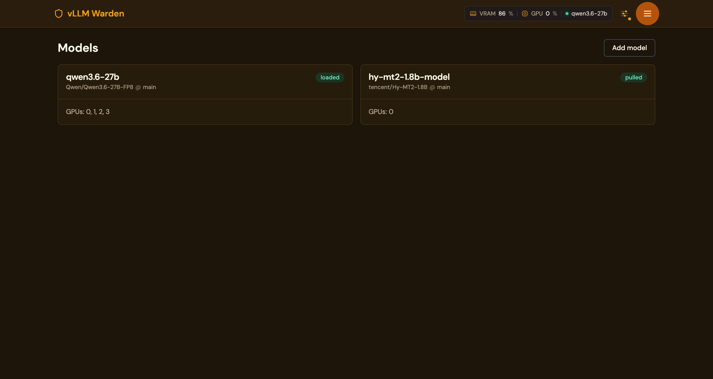

## What it is

vLLM is a high-throughput LLM inference engine, but it ships as a single-model
Python process with no UI, no authentication, no model switching, and no
visibility into what's actually happening on your GPUs. vLLM Warden wraps a
vanilla `vllm/vllm-openai` container with a control plane that adds:

- **Browser UI** — manage models, watch live logs, chat playground, stats dashboard
- **OpenAI-compatible API gateway** at `/v1/*` — drop-in replacement for OpenAI in
  any existing client (LangChain, OpenWebUI, agents, etc.)
- **Model lifecycle** — pull from HuggingFace, hot-swap models without restarting
  the container, persist settings per-model
- **Multi-token auth** — per-key rate limits, priority lanes, rotation grace
  windows, usage stats
- **HuggingFace cache manager** — see what's on disk, garbage-collect orphans
- **GPU observability** — VRAM / utilisation / power graphs, per-GPU breakdown,
  vLLM process attribution via host-PID sharing
- **Single-port topology** — Caddy front-door on `:8080` proxies UI + API + OpenAI
  shim, so one reverse-proxy rule covers the whole stack

## Why it was developed

Built to fill the gap between "I have vLLM running" and "I have a production
LLM service my team can actually use." Originally developed inside the
[PodWarden](https://podwarden.com) infrastructure platform as a managed workload,
then extracted as a standalone self-hostable app so people running vLLM on
their own GPUs can get the same UX without adopting PodWarden.

## Screenshots

<table>
  <tr>
    <td><a href="docs/img/01-models-list.png"></a><br/><sub>Models list</sub></td>
    <td><a href="docs/img/02-chat-playground.png">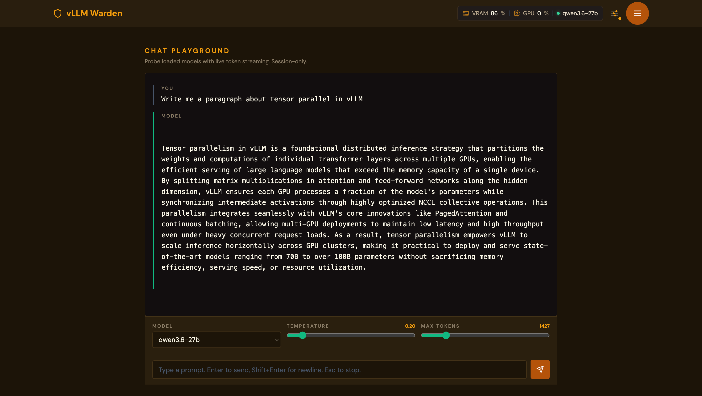</a><br/><sub>Chat playground</sub></td>
    <td><a href="docs/img/03-stats-dashboard.png">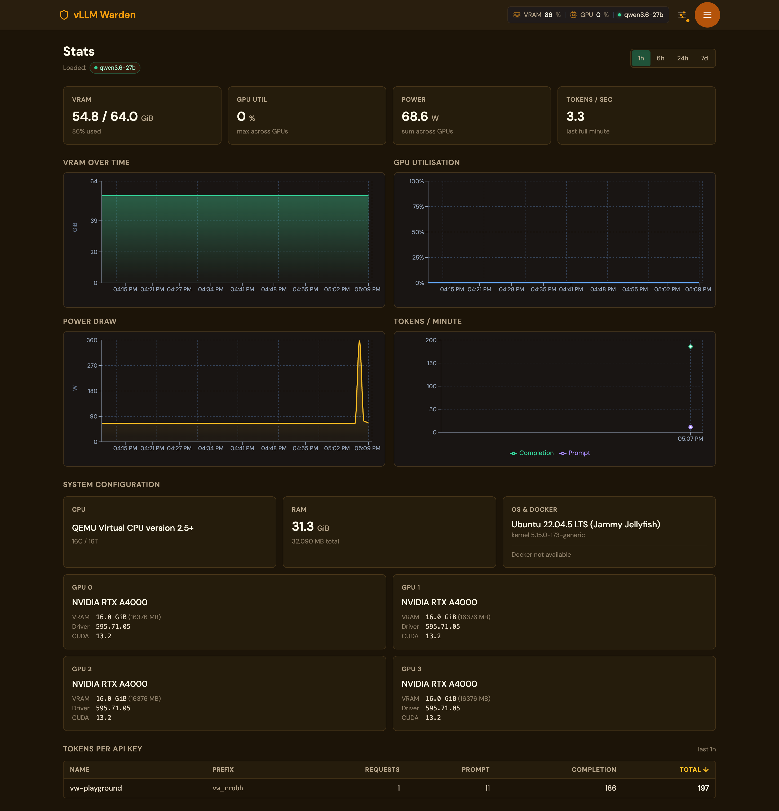</a><br/><sub>Stats dashboard</sub></td>
  </tr>
  <tr>
    <td><a href="docs/img/04-cache-manager.png">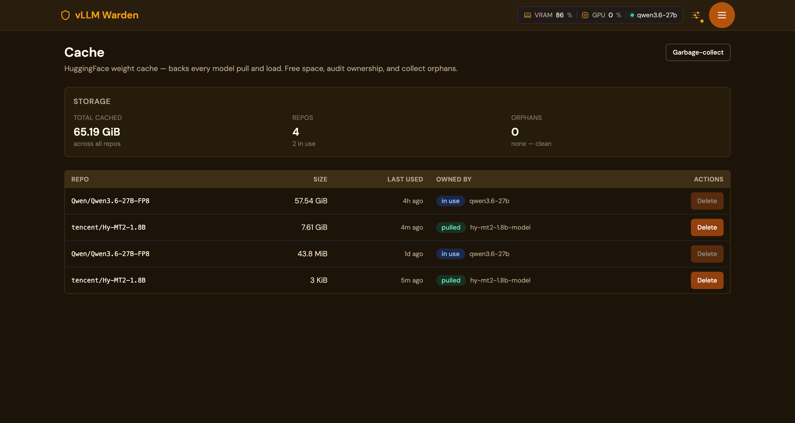</a><br/><sub>HF cache manager</sub></td>
    <td><a href="docs/img/05-api-tokens-list.png">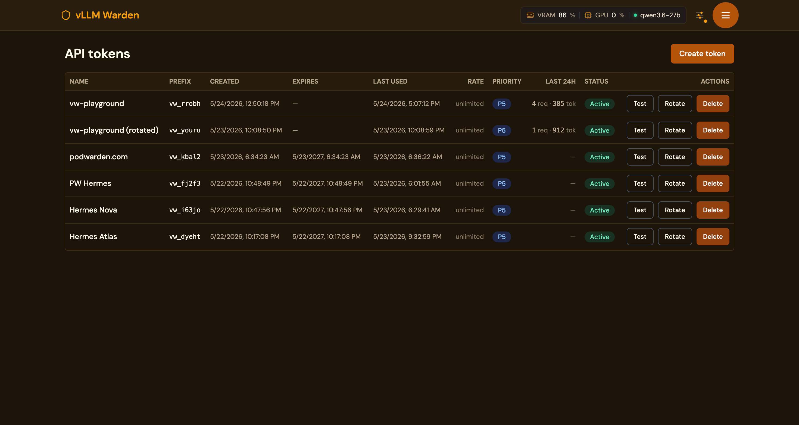</a><br/><sub>API tokens</sub></td>
    <td><a href="docs/img/06-api-tokens-create.png">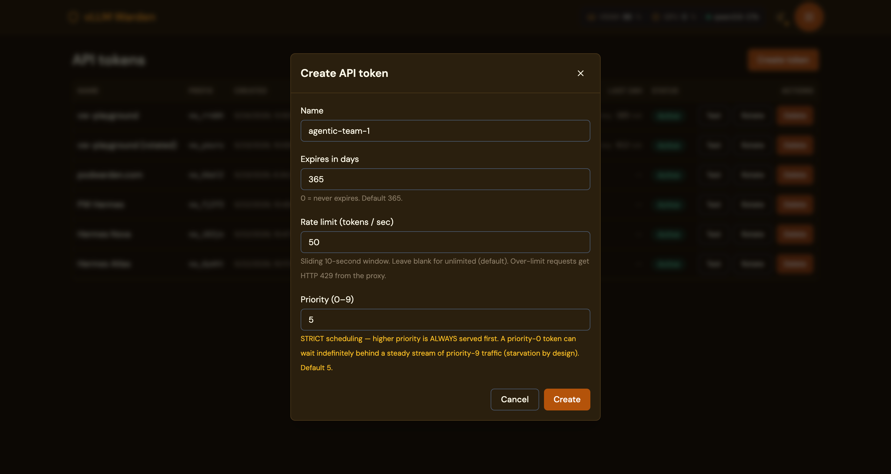</a><br/><sub>Create token</sub></td>
  </tr>
  <tr>
    <td><a href="docs/img/12-model-configuration-detail.png">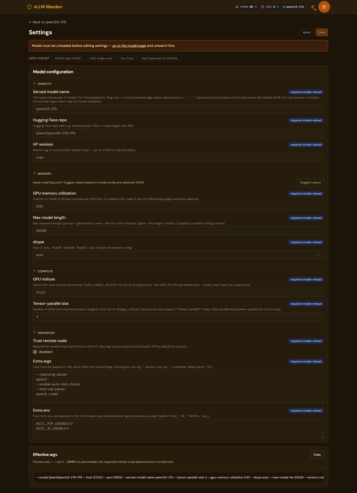</a><br/><sub>Model configuration</sub></td>
    <td><a href="docs/img/13-model-detail-live-logs.png">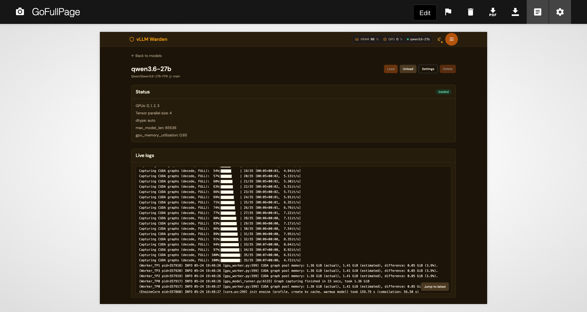</a><br/><sub>Live vLLM logs</sub></td>
    <td><a href="docs/img/07-settings-general.png">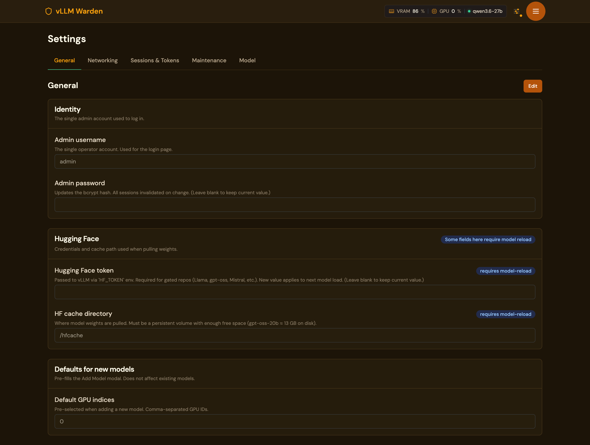</a><br/><sub>Settings</sub></td>
  </tr>
</table>

<details>
<summary>More screenshots (settings tabs)</summary>

| Networking | Sessions &amp; Tokens | Maintenance | Model |
|---|---|---|---|
| <a href="docs/img/08-settings-networking.png">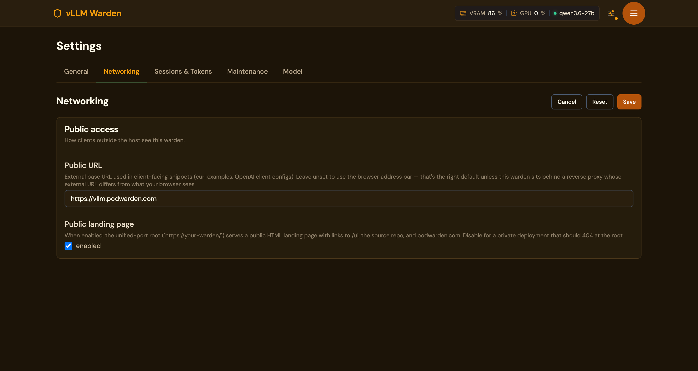</a> | <a href="docs/img/09-settings-sessions-tokens.png">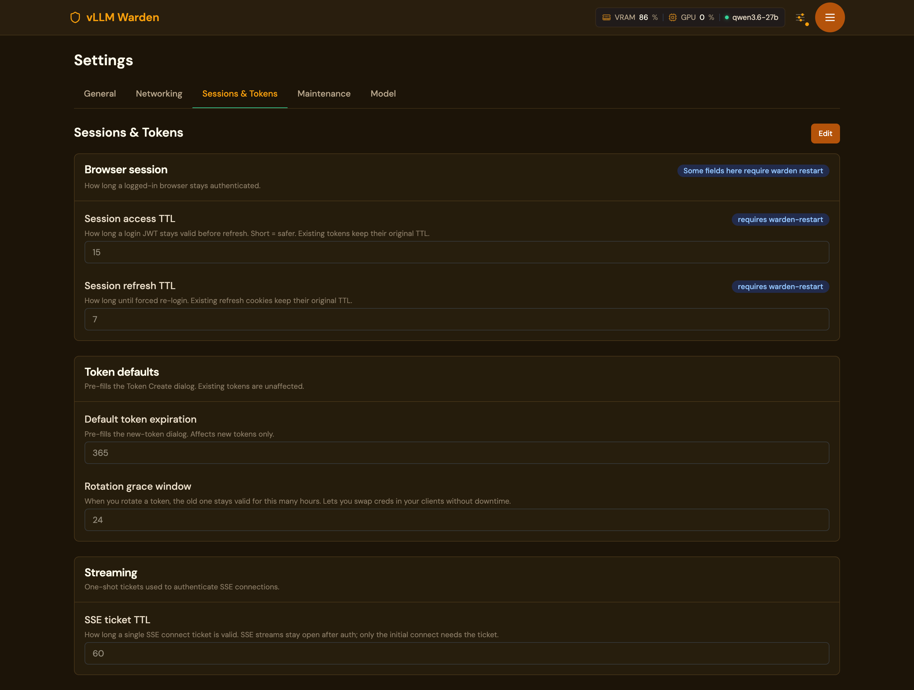</a> | <a href="docs/img/10-settings-maintenance.png">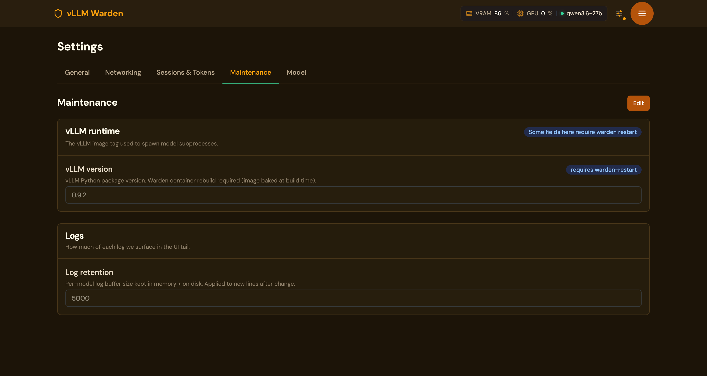</a> | <a href="docs/img/11-settings-model.png">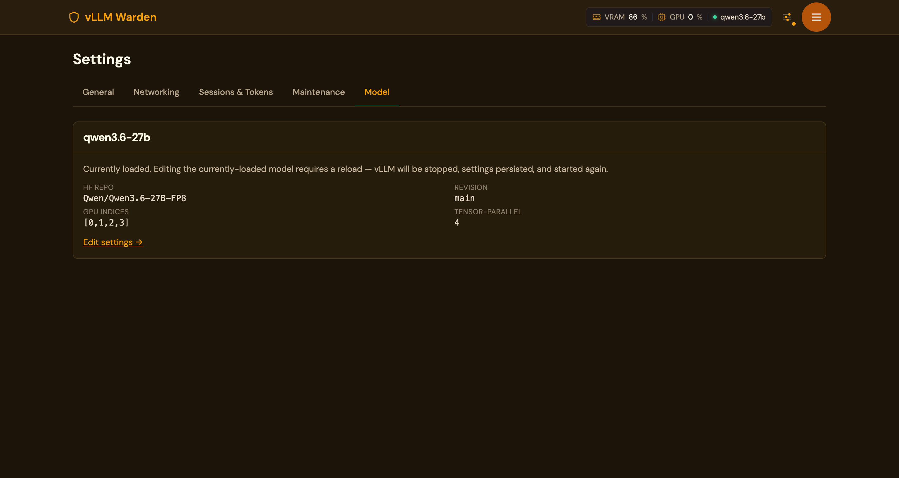</a> |

</details>

## How to install

The easiest way is to grab the prebuilt Docker installer from the PodWarden
Hub catalog. PodWarden Hub is a free public catalog of curated self-hostable
apps — no account needed to download an installer.

**1. Open the catalog page:**

<https://podwarden.com/catalog/vllm-warden>

**2. Click "Download Docker Installer".** You can either:

- **Copy-paste the install command** into a shell on your GPU host:

  ```bash
  curl -fsSL https://podwarden.com/api/v1/catalog/install/vllm-warden/script | bash
  ```

  The installer creates `/opt/vllm-warden/` (or `$HOME/vllm-warden/` if run
  as a non-root user without sudo), drops `docker-compose.yml` + `.env` +
  `Makefile`, auto-generates secrets, and pulls the prebuilt images.

- **Or download the bundle as a tarball** for offline / air-gapped installs.

**3. Start the stack:**

```bash
cd /opt/vllm-warden
nano .env          # review configuration
make start
make logs
```

Then open `http://YOUR-HOST:8080/ui/` in a browser.

**Requirements:** a Linux host with Docker + Docker Compose v2 + at least one
NVIDIA GPU + the NVIDIA Container Toolkit.

### Install with custom directory or flags

```bash
curl -fsSL https://podwarden.com/api/v1/catalog/install/vllm-warden/script | \
  bash -s -- --dir /srv/vllm --no-generate-secrets
```

## How to use (after install)

The installer drops a `Makefile` that wraps `docker compose`:

| Command          | What it does                                        |
|------------------|-----------------------------------------------------|
| `make start`     | `docker compose up -d` — start all services         |
| `make stop`      | `docker compose down` — stop all services           |
| `make restart`   | stop + start                                        |
| `make logs`      | `docker compose logs -f` — follow live logs         |
| `make pull`      | pull latest images and restart                      |
| `make build`     | pull images and build locally                       |
| `make status`    | `docker compose ps` — show service status           |
| `make uninstall` | stop + delete data volumes (asks for confirmation)  |
| `make help`      | list all targets                                    |

After `make start`:

- **Browser UI:** `http://YOUR-HOST:8080/ui/`
- **OpenAI-compatible API:** `http://YOUR-HOST:8080/v1/chat/completions` etc.
- **Warden control API:** `http://YOUR-HOST:8080/api/` (JWT-gated)
- **Health probe:** `http://YOUR-HOST:8080/healthz`

First-run: open `/ui/`, log in with the admin credentials from `.env`, then
**Models → Add model** to pull your first model from HuggingFace. For gated
models (Llama, gpt-oss, Mistral), set your HuggingFace token under
**Settings → General → Hugging Face token**.

## Build from source / contribute

Clone the repo and use the dev `Makefile`:

```bash
git clone https://github.com/Podwarden/vllm-warden.git
cd vllm-warden

# build the API + UI images locally
docker compose build

# run the stack against locally-built images
docker compose up -d
make smoke   # hits / /_landing /ui/ /api/csrf /healthz and asserts 200s
```

Dev targets (all run in Docker — no host-side Python/Node needed):

| Command                  | What it does                                                       |
|--------------------------|--------------------------------------------------------------------|
| `make test`              | run full pytest suite in a python:3.11-slim container              |
| `make test-unit`         | unit tests only                                                    |
| `make test-integration`  | integration tests only                                             |
| `make lint`              | `ruff check app/ tests/` (pinned via `requirements-dev.txt`)       |
| `make format`            | `ruff format app/ tests/`                                          |
| `make typecheck`         | `mypy app/`                                                        |
| `make docker-build`      | build the api image as `vllm-warden:dev`                           |
| `make docker-run`        | run `vllm-warden:dev` with `--gpus all --pid=host` on :8080        |
| `make smoke`             | end-to-end HTTP smoke against `docker compose up`                  |
| `make generate-api-types`| regenerate `frontend/src/lib/api-types.generated.ts` from FastAPI OpenAPI schema |

The Dockerfile pins `vllm/vllm-openai:v0.20.0` and applies a few in-place
patches for Qwen3.5 / Qwen3.6 GGUF loading — see the comments at the top of
`Dockerfile` for the upstream tracker links.

## Architecture

Single host port `:8080` (Caddy) fans out to internal-only api + ui containers:

| Path        | Backend             | Notes                                  |
|-------------|---------------------|----------------------------------------|
| `/`         | FastAPI `/_landing` | Public HTML landing page (opt-out)     |
| `/ui/*`     | Next.js (ui)        | Browser-facing UI                      |
| `/api/*`    | FastAPI (api)       | JWT-gated control plane                |
| `/v1/*`     | FastAPI (api)       | OpenAI-compatible proxy (token-gated)  |
| `/healthz`  | Next.js (ui)        | Liveness probe                         |

The api container shares the host PID namespace so GPU process attribution
works (`/api/system/gpus` can map host PIDs back to supervisor-tracked vLLM
workers). See `deploy/caddy/Caddyfile` for the live routing map.

## License

[Apache License 2.0](LICENSE).

## Trademarks

vLLM is a project of the [vLLM team](https://github.com/vllm-project/vllm).
PodWarden is a trademark of its operators. vLLM Warden is not affiliated with
or endorsed by either project.
