# vLLM Warden

**Run your own OpenAI-compatible LLM API on your own GPUs — with a UI, not a config file.**

[vLLM](https://github.com/vllm-project/vllm) is a fast inference engine, but it ships as a
single-model Python process: no UI, no auth, no model switching, and no view of what your
GPUs are doing. vLLM Warden wraps it in a control plane so you can pull a model from
HuggingFace, load it, and hand your team an API key — from a browser, in minutes.

[](LICENSE)
[](https://github.com/vllm-project/vllm)
[](#install)

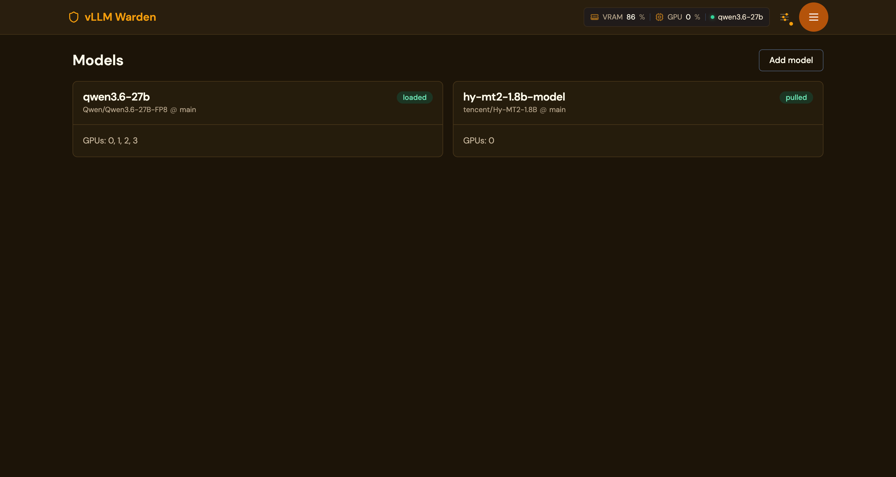

---

## Quick start

A Linux host with Docker Compose v2, an NVIDIA GPU, and the NVIDIA Container Toolkit:

```bash
curl -fsSL https://podwarden.com/api/v1/catalog/install/vllm-warden/script | bash
cd /opt/vllm-warden
make start
```

Open `http://YOUR-HOST:8080/ui/`. A first-run wizard walks you through picking
which GPUs to use, adding a HuggingFace token, and creating your admin account.
Then go to **Models → Add model** and pull your first model.

Your OpenAI-compatible endpoint is live at:

```
http://YOUR-HOST:8080/v1/chat/completions
```

Point any OpenAI client at it — LangChain, OpenWebUI, the `openai` SDK, your agents.
Only the `base_url` and the key change.

## Why you might want it

| Without | With vLLM Warden |
|---|---|
| One model per container, restart to switch | Hot-swap models from the browser |
| A single shared API key, or none | Per-key tokens, rate limits, priority lanes, rotation |
| `nvidia-smi` in a second terminal | VRAM, utilisation and power graphs, per-GPU |
| No idea why a request is slow | Live per-request table, KV-cache pressure, TTFT/latency percentiles |
| Hand-edited `--tensor-parallel-size` flags | Guided model setup with a config UI |
| An abandoned request pins a GPU slot | Request reaper reclaims it automatically |

## Features

- **Browser UI** — model management, live vLLM logs, chat playground, stats dashboards
- **OpenAI-compatible gateway** at `/v1/*` — drop-in for any existing client
- **Model lifecycle** — pull from HuggingFace, hot-swap without restarting the container,
  per-model settings, GGUF support via the out-of-tree
  [`vllm-gguf-plugin`](https://pypi.org/project/vllm-gguf-plugin/)
- **Multi-token auth** — per-key rate limits, priority lanes, rotation grace windows, usage stats
- **Realtime dashboard** — per-second engine load, KV-cache pressure, throughput and latency
  percentiles, live request table
- **HuggingFace cache manager** — see what's on disk, garbage-collect orphans
- **GPU observability** — per-GPU VRAM/utilisation/power, with vLLM process attribution
- **Automatic crash recovery** — a dead engine is detected, evidence is captured, and the
  model is reloaded without human intervention
- **Single-port topology** — one Caddy front door on `:8080` serves UI, control API and the
  OpenAI shim, so one reverse-proxy rule covers everything

## Screenshots

<table>
  <tr>
    <td><a href="assets/screenshots/02-chat-playground.png">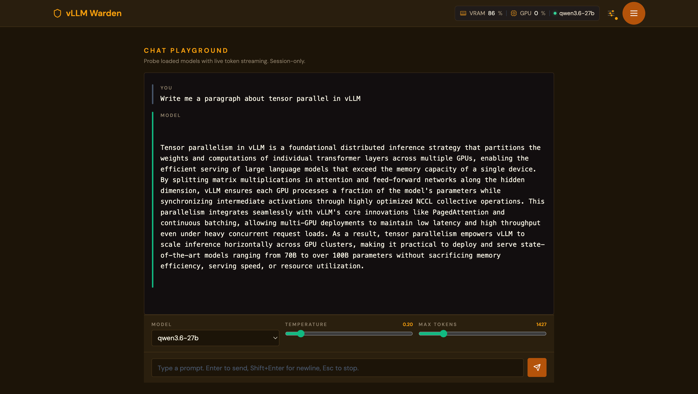</a><br/><sub><b>Chat playground</b> — try a model without wiring up a client</sub></td>
    <td><a href="assets/screenshots/03-stats-dashboard.png">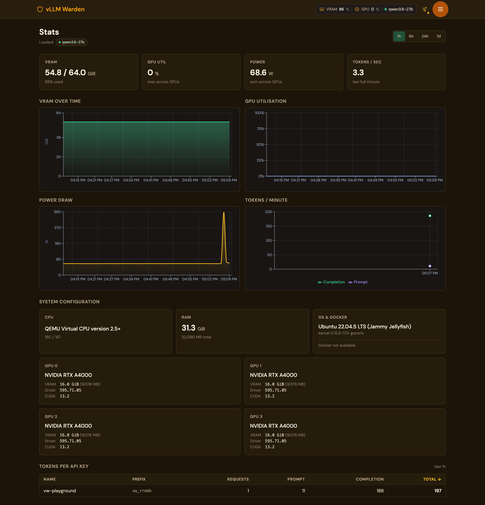</a><br/><sub><b>Stats</b> — throughput, latency, token usage per key</sub></td>
  </tr>
  <tr>
    <td><a href="assets/screenshots/12-model-configuration-detail.png">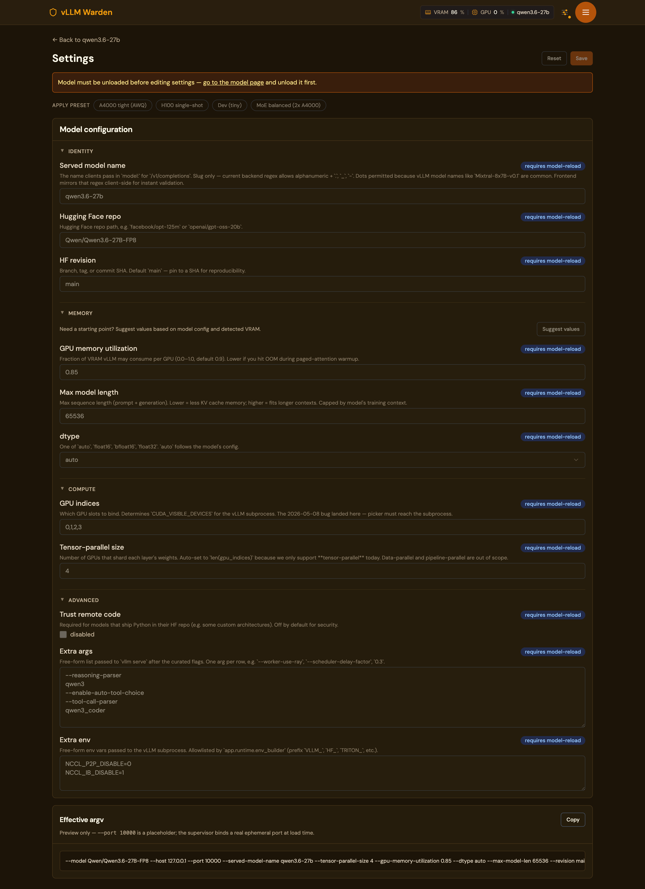</a><br/><sub><b>Model config</b> — parallelism, quantization, context length</sub></td>
    <td><a href="assets/screenshots/13-model-detail-live-logs.png">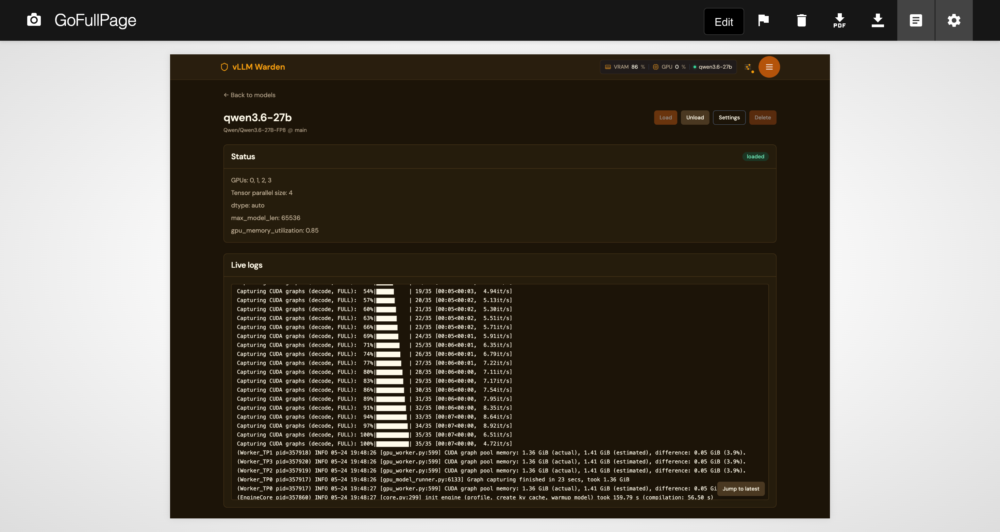</a><br/><sub><b>Live engine logs</b> — stream vLLM output while it loads</sub></td>
  </tr>
  <tr>
    <td><a href="assets/screenshots/05-api-tokens-list.png">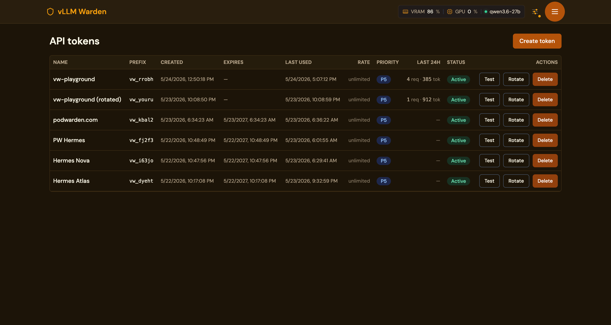</a><br/><sub><b>API tokens</b> — per-key limits and usage</sub></td>
    <td><a href="assets/screenshots/04-cache-manager.png">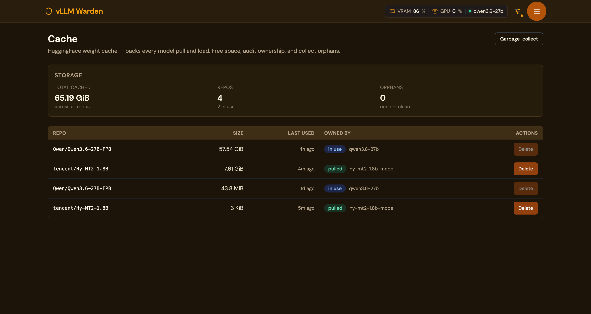</a><br/><sub><b>HF cache</b> — reclaim disk from orphaned weights</sub></td>
  </tr>
</table>

<details>
<summary>More screenshots — settings tabs</summary>

| General | Networking | Sessions &amp; Tokens | Maintenance |
|---|---|---|---|
| <a href="assets/screenshots/07-settings-general.png">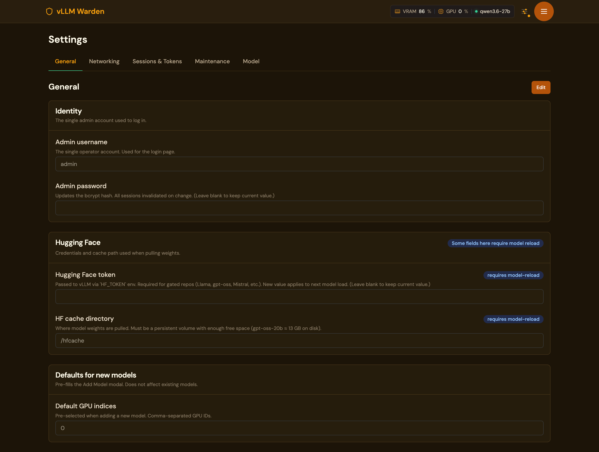</a> | <a href="assets/screenshots/08-settings-networking.png">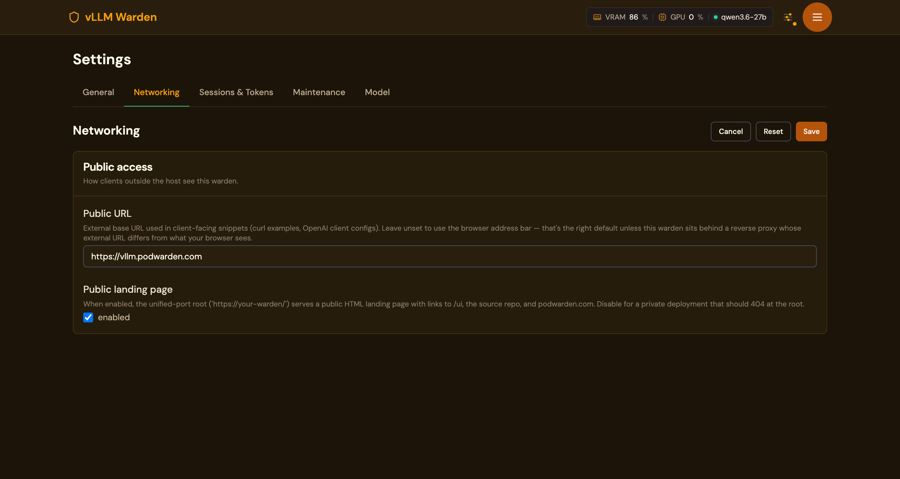</a> | <a href="assets/screenshots/09-settings-sessions-tokens.png">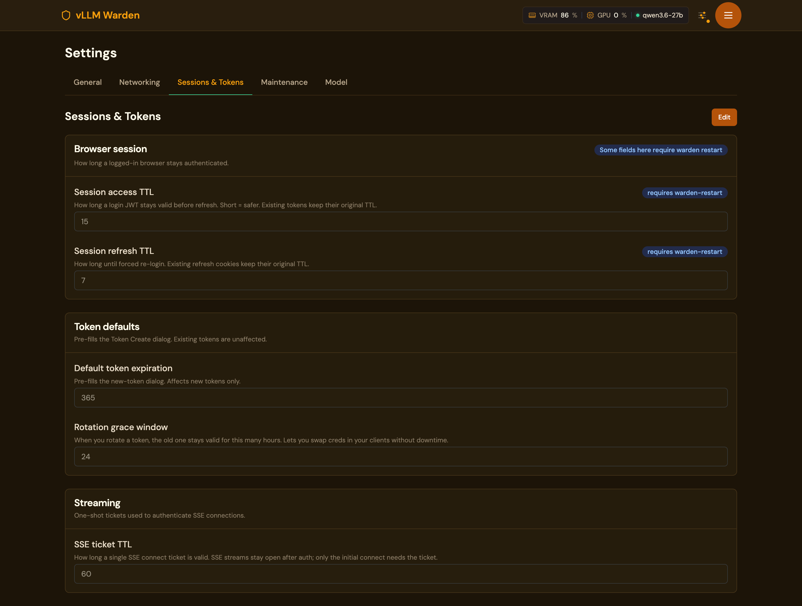</a> | <a href="assets/screenshots/10-settings-maintenance.png">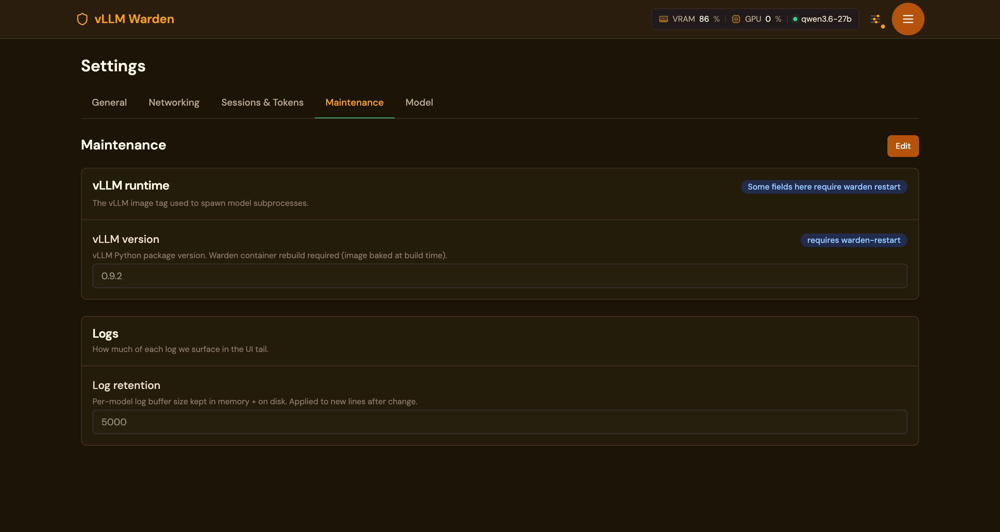</a> |

</details>

## Install

The quickest path is the prebuilt installer from the PodWarden Hub catalog — a free public
catalog of self-hostable apps. No account needed.

**Catalog page:** <https://podwarden.com/catalog/vllm-warden>

```bash
curl -fsSL https://podwarden.com/api/v1/catalog/install/vllm-warden/script | bash
```

The installer creates `/opt/vllm-warden/` (or `$HOME/vllm-warden/` when run without sudo),
writes `docker-compose.yml`, `.env` and a `Makefile`, generates secrets, and pulls the
images. A tarball is available from the same page for offline or air-gapped installs.

Custom directory or flags:

```bash
curl -fsSL https://podwarden.com/api/v1/catalog/install/vllm-warden/script | \
  bash -s -- --dir /srv/vllm --gpus 0,1 --origin https://vllm.example.com
```

`--gpus` limits which GPUs the container sees (`none`, `all`, or an index list),
and `--origin` sets `VW_FRONTEND_ORIGIN` — the public URL you will reach the UI
on, which the CSRF check enforces. Set it once you put the warden behind a
domain; the default localhost value is fine for a first look. Pass
`--no-generate-secrets` to fill in `.env` yourself.

**Requirements:** Linux, Docker + Docker Compose v2, at least one NVIDIA GPU, and the
NVIDIA Container Toolkit.

### Day-to-day

| Command | What it does |
|---|---|
| `make start` | start all services |
| `make stop` | stop all services |
| `make restart` | stop + start |
| `make logs` | follow live logs |
| `make pull` | pull the latest images and restart |
| `make status` | show service status |
| `make uninstall` | stop and delete data volumes (asks first) |
| `make help` | list every target |

Once running:

- **UI** — `http://YOUR-HOST:8080/ui/`
- **OpenAI API** — `http://YOUR-HOST:8080/v1/chat/completions`
- **Control API** — `http://YOUR-HOST:8080/api/` (JWT-gated)
- **Health** — `http://YOUR-HOST:8080/healthz`

For gated models (Llama, Mistral, gpt-oss) you need a HuggingFace token. The
first-run wizard asks for one, and you can change it later under
**Settings → General**.

## Architecture

One published port. Caddy fans out to internal-only `api` and `ui` containers:

| Path | Backend | Notes |
|---|---|---|
| `/` | FastAPI `/_landing` | Public landing page (can be disabled) |
| `/ui/*` | Next.js | Browser UI |
| `/api/*` | FastAPI | JWT-gated control plane |
| `/v1/*` | FastAPI | OpenAI-compatible proxy (token-gated) |
| `/healthz` | Next.js | Liveness probe |

The `api` container shares the host PID namespace so GPU process attribution can map host
PIDs back to supervisor-tracked vLLM workers. Routing lives in `deploy/caddy/Caddyfile`.

## Build from source

```bash
git clone https://github.com/Podwarden/vllm-warden.git
cd vllm-warden
docker compose build
docker compose up -d
make smoke      # asserts 200s across / /_landing /ui/ /api/csrf /healthz
```

Every dev target runs in Docker — no host Python or Node required:

| Command | What it does |
|---|---|
| `make test` | full pytest suite in `python:3.11-slim` |
| `make test-unit` / `make test-integration` | one suite only |
| `make lint` / `make format` | `ruff check` / `ruff format` |
| `make typecheck` | `mypy app/` |
| `make docker-build` | build the api image as `vllm-warden:dev` |
| `make generate-api-types` | regenerate frontend types from the FastAPI OpenAPI schema |

The image is built on a digest-pinned `vllm/vllm-openai` base (currently v0.26.0). GGUF
support moved out of vLLM core in the 0.25.x line, so the build installs and patches
`vllm-gguf-plugin`. The `Dockerfile` documents each patch and why it exists — worth reading
before bumping the base image.

## Contributing

Issues and pull requests are welcome. Please run `make lint` and `make test` before opening
a PR; both run in containers, so a working Docker install is the only prerequisite.

## License

[Apache License 2.0](LICENSE).

## Trademarks

vLLM is a project of the [vLLM team](https://github.com/vllm-project/vllm). PodWarden is a
trademark of its operators. vLLM Warden is not affiliated with or endorsed by either project.
