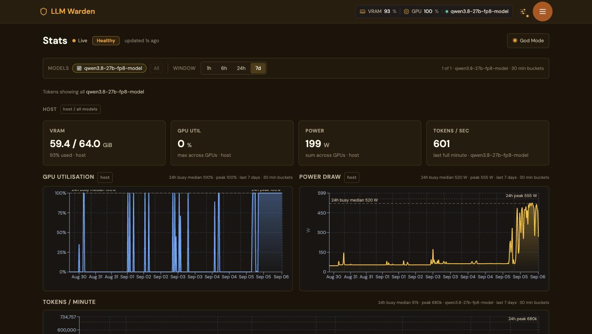
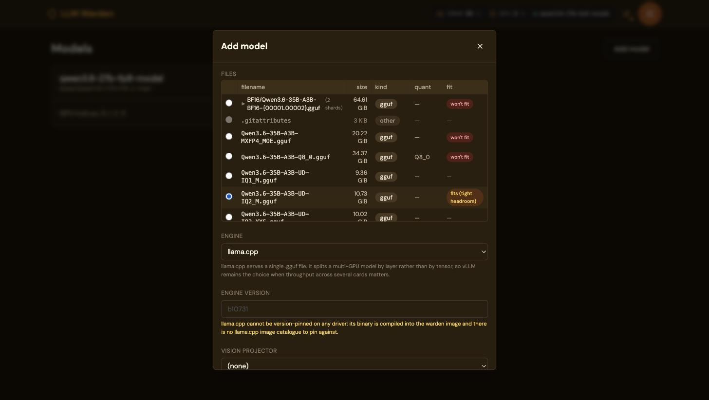
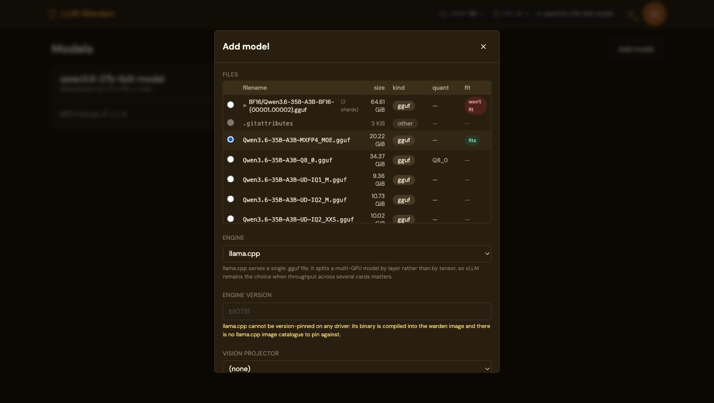
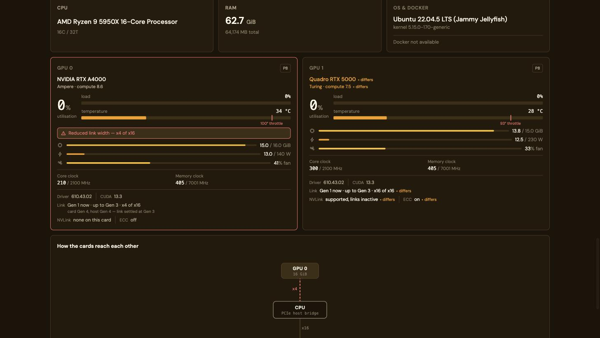
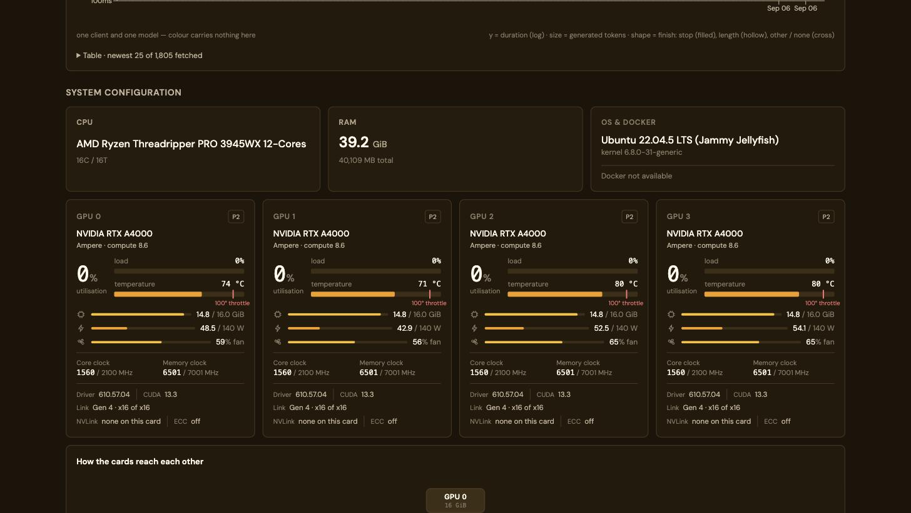
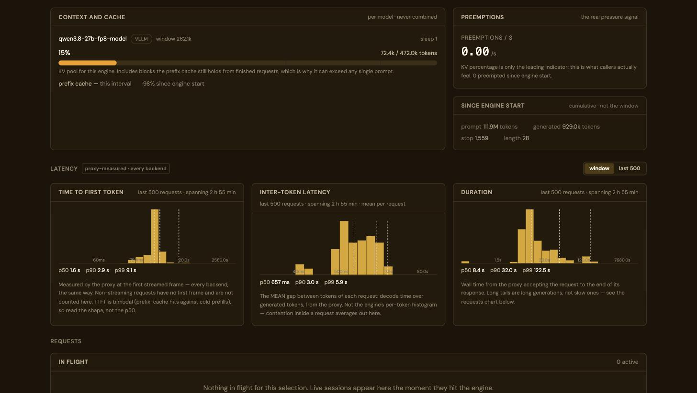
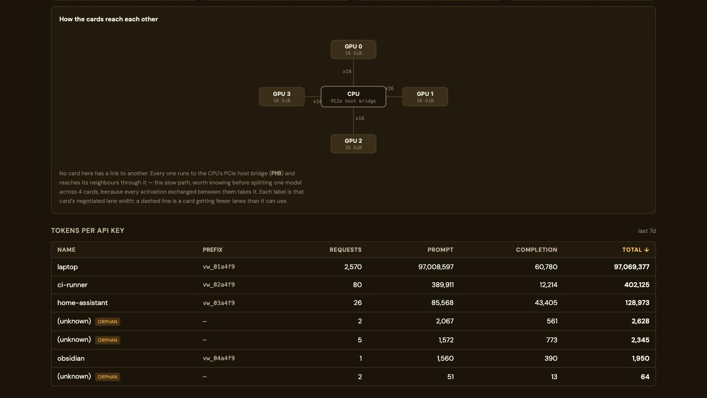
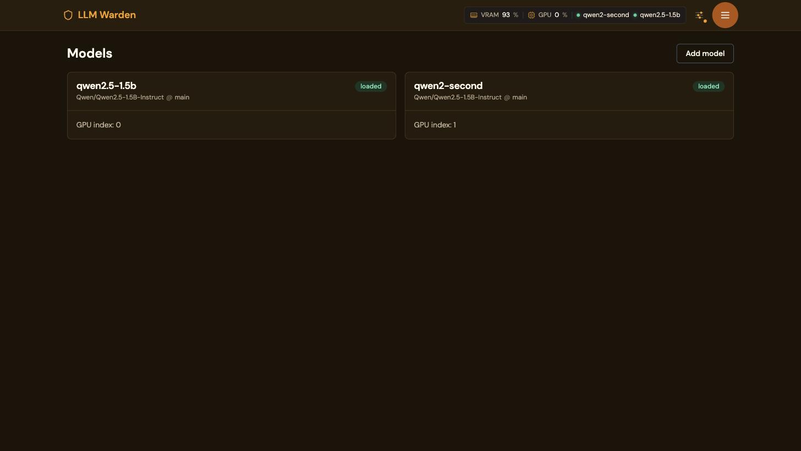
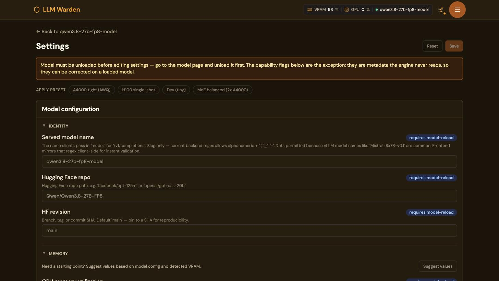

# LLM Warden

**Your own OpenAI-compatible API, on your own NVIDIA GPUs. Two mainline engines
— vLLM and llama.cpp — behind one control plane, one port, and a browser UI.**

[](LICENSE)
[](#two-engines-and-the-model-that-made-us-add-the-second)
[](#install)



You have NVIDIA GPUs — in a rack, in a workstation, or two cards bought
eighteen months apart in a box under a desk. You want what is on them to be
reachable the way a hosted API is reachable: a base URL, a key, and a client
library that already exists. And you want the things a hosted API gives you as
a matter of course and a bare engine does not give you at all — a separate key
per consumer, usage attributed to it, and a straight answer about what the
hardware is doing — without one container per model, a
`--tensor-parallel-size` you arrived at by bisection, and `nvidia-smi` open in
a second terminal to find out why a request is slow.

LLM Warden is the control plane around the engines. Pull a model from
HuggingFace, load it, mint a key, see what that key spent, watch what the card
is actually doing. One published port, so your own TLS terminator, ingress,
SSO or network policy sits in front of it unchanged. Nothing leaves the host:
no account, no licence check, no analytics, and an
[offline install](#offline--air-gapped-install) for machines with no route out
at all.

The engines themselves are upstream and unmodified — that is a hard rule, and
[the second engine exists because of it](#two-engines-and-the-model-that-made-us-add-the-second).

---

## What it is, and what it is not

It is a wrapper, and that is the whole claim. It does not make models faster,
it does not fork an engine, and it will not do anything to your tokens that
`vllm serve` would not. What it adds is the part nobody ships: model
lifecycle, per-key auth with usage accounting, and an honest view of the GPU.

**The shape of it.** Three containers behind one Caddy front door on a single
published port; JWT sessions with CSRF on the control plane and bearer tokens
on `/v1/*`; a SQLite store with numbered migrations; an engine watchdog that
probes `/health` rather than trusting the process tree; `mypy --strict`
against a committed baseline, and a pytest suite that runs in a container.
`make lint`, `make typecheck`, `make test` — all three on a clean checkout, no
host Python.

**The hardware it runs on.** NVIDIA only — no ROCm, no Metal, no CPU serving
path. vLLM's own support matrix applies unchanged, because it is upstream's
image. **The floor is Turing (sm_75)**: the base image ships CUDA 13, which
dropped Maxwell, Pascal and Volta, so a GTX 1080 Ti, a Titan X or a V100 will
not work here and no rebuild changes that. Above that floor the llama.cpp
binary shipped in the api image carries native SASS for **every architecture
CUDA 13 can target** — Turing through Blackwell, including Ada, Hopper and the
RTX 50-series — plus PTX, so a card newer than this release JIT-compiles on
first load instead of finding no backend at all. Narrowing the list to your own
cards is a build argument and makes the build much shorter:
[the build works from a plain clone](#build-from-source), which is also where
the current list is written down. And FP8 weights on Ampere are numerically
broken upstream, not slow: the model loads, streams tokens, and emits garbage.
The product warns about that rather than letting you discover it.

**Nothing reports to us.** No account, no licence check, no analytics, no
callback — [`install.sh`](install.sh) and
[`docker-compose.yml`](docker-compose.yml) are the entire deployment and you
can read both. No part of a request leaves the host. The stack makes outbound
calls only when you ask it to: huggingface.co to pull weights
(`HF_HUB_OFFLINE=1` stops even that), Docker Hub to list published vLLM tags
when you open the engine-version picker, and the release registry for the
images — which `docker load` replaces entirely, see
[Offline / air-gapped install](#offline--air-gapped-install). On a host with
no route out, none of the three is needed.

**Leaving is a `base_url` change.** Apache-2.0, OpenAI-compatible on the way
in. The weights sit in an ordinary HuggingFace cache volume that
`make export-hf-cache` hands you as a tarball. The exact argv each engine was
launched with is a GET away (`/api/models/{id}/effective-argv`), so
reproducing a working configuration outside this product is copy and paste.

**What is automatic, and what is not.** A dead engine under a live wrapper is
detected, its evidence is captured and the model is reloaded without you —
that one exists because the engine core died four times in one day while the
`vllm serve` wrapper stayed alive and the proxy kept forwarding to a corpse.
Other things are deliberately not automatic: the wall-clock request reaper is
**off by default** (`request_max_wall_s`), and a GPU is claimed by one model
until you unload it.

This README was walked end to end from the published release, on a host it had
not been developed on, following only what is written here — install, wizard,
key, register, pull, load, a real completion. Four things it did not say then
are sections of their own now:
[a first run with no browser](#first-run-without-a-browser), that
[pull and load are separate asynchronous steps](#adding-a-model-from-the-api)
and pull progress is an SSE stream, that
[a GPU serves one loaded model at a time](#one-loaded-model-per-gpu), and that
`gpu_memory_utilization` is a fraction of the whole card.

## Don't use this if…

None of these are solvable by configuration.

- **You have no NVIDIA GPU.** There is no ROCm, Apple Silicon or CPU-serving
  path. `--gpus none` starts the control plane for evaluation and CI; nothing
  can be loaded on it.
- **You need to serve one model across several machines.** This is a
  single-host Compose stack. Multiple GPUs in one box, yes; multi-node, no.
- **You want a hosted API.** Nobody operates this for you. You supply the
  hardware, the driver, the disk and the electricity.
- **You need a backend that is not vLLM or llama.cpp** — TensorRT-LLM, SGLang,
  MLX, Ollama's runtime. The seam to add one is real and small, but nothing
  else ships today.
- **You want several models resident on one card.** One loaded model per GPU is
  an ownership rule enforced before an engine starts. No amount of tuning gets
  past it.
- **You want tensor parallelism out of llama.cpp.** It splits layers, not
  tensors. For a model too large for one card, vLLM is still the right answer.
- **Your host is not Linux x86_64.** The api image is built on upstream's CUDA
  base and needs both.

---

## Quick start

A Linux host with Docker, Docker Compose v2.24+ (v5.x is fine), an NVIDIA GPU,
the NVIDIA Container Toolkit, and 40 GB free where Docker keeps its images:

```bash
git clone https://github.com/Podwarden/vllm-warden.git
cd vllm-warden
./install.sh
make smoke      # 200s across / /_landing /ui/ /api/csrf /healthz
```

The installer checks the host, lets you pick GPUs, generates the secrets, pulls
the release images and offers to start the stack — details under
[Install](#install). Open `http://YOUR-HOST:8080/ui/`; a first-run wizard covers
GPU selection, a HuggingFace token and your admin account. Then **Models → Add
model**.

Your OpenAI-compatible endpoint is live at:

```
http://YOUR-HOST:8080/v1/chat/completions
```

Point any OpenAI client at it — LangChain, OpenWebUI, the `openai` SDK, your
agents. Only the `base_url` and the key change.

Scripting the whole thing instead of clicking?
[First run without a browser](#first-run-without-a-browser) is the six-call
version, and [Adding a model from the API](#adding-a-model-from-the-api) is the
rest.

---

## Two engines, and the model that made us add the second

There is one product invariant, and everything below follows from it:

> **We ship mainline runtimes. No monkeypatching, ever.**

No patched engine image, no vendored fork, no `sh -c "patch && exec …"`
entrypoint, no `sitecustomize.py`, no `LD_PRELOAD`. A launch is argv plus
environment and nothing else. That is enforced by the type the launch path
speaks — it has no field to put a patch in — and by a test that fails if the
vocabulary reappears.

The invariant is easy to hold right up until a model you want will not load.

**The worked example.** `ISTA-DASLab/Qwen3.8-27B-3Bit-GSQ` quantises the
embedding table. Mainline vLLM's weight loader has no entry for it, so the load
dies with:

```
ValueError: There is no module or parameter named 'embed_tokens.weight_packed'
in Qwen3_5Model
```

The model card's own remedy is a newer vLLM **plus a Python monkeypatch applied
to the interpreter before the server starts**. Under the invariant that is not
"hard", it is forbidden. So on vLLM this model is unsupported, and stays
unsupported until upstream adds the format.

The same authors publish a GGUF conversion, and their model card says it runs
unmodified in llama.cpp. It does. Measured, on one 16 GiB RTX A4000:

| | |
|---|---|
| Repo | `ISTA-DASLab/Qwen3.8-27B-GSQ-RCO-GGUF` |
| Weights | `Qwen3.8-27B-GSQ-RCO-IQ3_XXS.gguf` — 10,094,357,632 B |
| Vision projector | `mmproj-Qwen3.8-27B-BF16.gguf` — 931,146,528 B |
| Context | `--ctx-size 8192`, requested and held |
| Steady-state VRAM | 12,039 MiB of 16,376 MiB |
| CPU offload | none — llama.cpp's own sizing kept every layer on the card |

Coherent multi-turn chat across a deliberate distractor, correct arithmetic,
exact format compliance, and a correct description of an image generated for the
test — through the product's own `/v1/chat/completions`, not against the engine
port.

The claim is narrow: *a model the product genuinely could not serve is served,
unmodified, by a different mainline backend.* One row, one field. It is not
that vLLM is bad. It is that being locked to a single engine does not make the
other models slower — it makes them unavailable.

Three consequences:

- **GGUF quantisation fits larger models onto smaller cards.** A 27B model on
  one 16 GiB card is a 3-bit quant's whole point.
- **Older GPUs stay useful as vLLM's support moves on.** Turing is not on
  vLLM's happy path any more; llama.cpp still serves it.
- **Heterogeneous boxes are ordinary, not exotic.** An Ampere card next to a
  Turing card is what a machine that grew looks like, and the stats page reads
  them as two different cards rather than averaging them into a fiction.

### What the second engine costs

**llama.cpp publishes no latency histograms at all.** vLLM exposes four; the
llama.cpp `/metrics` endpoint has none. The choice was to leave the latency
panels blank for GGUF models, or to measure latency somewhere both engines have
in common — so the panels now come from the **proxy's own** measurements: TTFT
at the first streamed frame, duration at the end of the stream, persisted per
request. GGUF models got a latency panel for the first time because of that gap.
What is given up is the engine's per-token resolution; the stored inter-token
latency is a mean per request and is labelled that way everywhere it appears.

The same rule runs through the rest of the metrics: a number the engine does not
report renders as **"not reported"**, never as `0`. A zero says "plenty of KV
headroom" or "the engine is idle"; the truth is "this engine is silent about
that", and an operator who acts on the first has been actively misled. On
llama.cpp that means KV-cache usage, sleep state, preemptions and MFU are blank
rather than reassuring.

Two more limits worth knowing before you pick it:

- **llama.cpp's version is fixed by the warden image** (`b10731`). Bumping it is
  a warden release, not a per-model choice. vLLM's version can be pinned per
  model, but only under the Docker engine driver — the UI disables the control
  and says which of the two reasons applies rather than offering a switch that
  does nothing.
- **A GGUF-only repository ships no tokenizer**, so token accounting falls back
  to a character estimate (which also drives per-token rate limits). Set
  `tokenizer_repo` to the upstream safetensors sibling and counts are exact,
  local and free. The degradation is reported rather than hidden.

Choosing between them is mostly automatic: pick a `.gguf` file in **Add model**
and the wizard pre-selects llama.cpp. It is a pre-selection, not a rule — a GGUF
that vLLM can also serve stays available to vLLM.

---

## What you get

A bare engine is a single-model process. This is what sits around it — and
once the hardware is bought, a request costs electricity rather than a
per-token line on someone's invoice.

| A bare engine | With LLM Warden |
|---|---|
| One model per container, restart to switch | Register, pull, load and unload from the browser |
| One engine, take it or leave it | vLLM **and** llama.cpp, chosen per model |
| A single shared API key, or none | A key per consumer, each with its own token-rate limit, priority lane and rotation grace window |
| No record of who used what | Requests, prompt tokens and completion tokens rolled up per key and per client IP |
| No way to see what a client actually sent | God Mode: an opt-in, in-memory live view of prompts and completions, off by default |
| A port per engine to expose | One published port — your own TLS terminator, ingress, SSO or network policy goes in front of it |
| `nvidia-smi` in a second terminal | Per-card VRAM, utilisation, power, temperature against the driver's own throttle point, PCIe width, ECC, NVLink |
| No idea why a request is slow | Live request table, TTFT and duration distributions from the proxy, KV-cache pressure and preemptions where the engine reports them |
| Hand-edited `--tensor-parallel-size` | Guided setup, a fit preview before you pull, and a stress test that measures the ceiling |
| A dead engine nobody notices | `/health` watchdog, evidence captured, model reloaded |

- **Browser UI** — models, live engine logs, chat playground, stats.
- **OpenAI-compatible gateway** at `/v1/*` — drop-in for any existing client.
  `GET /v1/models` reports `max_model_len`, so clients stop guessing the context
  window.
- **Model lifecycle** — pull from HuggingFace, hot-swap without restarting the
  container, per-model settings, GGUF on either engine.
- **Per-key auth and accounting** — one token per consumer, each with its own
  token-per-second rate limit (`VW_RATE_LIMIT_WINDOW_S` sets the window it is
  measured over), priority lane and rotation grace window. Requests, prompt
  tokens and completion tokens are attributed to the key that spent them and
  to the IP that called; `GET /api/tokens/{id}/usage` returns the same
  1 h / 24 h / 7 d rollup the page draws, minute by minute.
- **Request-level visibility** — a live table of what is in flight: key,
  client IP, model, context used against `max_model_len`, prefill or decode,
  and whether the caller has already disconnected. Finished requests are
  persisted with TTFT, duration and how each one ended. All of that is
  metadata: the `request_history` table has no column that holds prompt or
  completion text.
- **Reading what a client actually sent** — God Mode is an opt-in live view of
  prompts, completions and inline images, off by default and held only in a
  bounded in-memory ring. It, and the one other feature that can capture
  content, are described together with their bounds under
  [Where request content can end up](#where-request-content-can-end-up).
- **HuggingFace cache manager** — see what is on disk, garbage-collect orphans,
  export and import the whole cache as a tarball.
- **GPU observability** — per-card telemetry with engine process attribution,
  plus an interconnect graph read from `nvidia-smi topo -m`, so you can see
  whether two cards have a path to each other before splitting a model across
  them.
- **Single-port topology** — one Caddy front door on `:8080` serves UI, control
  API and the OpenAI shim, so one reverse-proxy rule covers everything. It does
  not want to own your edge: terminate TLS where you already terminate it.
- **Runs with no route out** — three image tarballs plus an optional
  model-cache tarball are the entire transport, and `HF_HUB_OFFLINE=1` stops
  the stack contacting huggingface.co at all. See
  [Offline / air-gapped install](#offline--air-gapped-install).

<table>
<tr>
<td width="50%"><br>
<b>Pick the quant your hardware can actually run.</b> Point it at a repo and it lists
every file with a verdict — here a 35B where BF16, Q8_0 and MXFP4 are all too big
and <code>UD-IQ2_M</code> fits.</td>
<td width="50%"><br>
<b>Tick more cards and the budget adds up.</b> The 20.22 GiB file that will not fit
on one 16 GiB card fits across four — the verdict recomputes as you select GPUs.</td>
</tr>
<tr>
<td><br>
<b>Mismatched cards, read honestly.</b> An Ampere A4000 beside a Turing Quadro:
architecture, VRAM, power cap and ECC all differ, and the reduced PCIe link width
is called out rather than buried.</td>
<td><br>
<b>Per card, not per host.</b> Clocks, temperature, power, fan, driver and CUDA for
each card, with the throttle threshold marked on the temperature bar.</td>
</tr>
<tr>
<td><br>
<b>Latency measured at the proxy.</b> TTFT, inter-token and duration
distributions the same way for every backend — plus KV pool occupancy, prefix
cache hit rate and the preemption rate.</td>
<td><br>
<b>How the cards reach each other.</b> The PCIe topology, with negotiated lane
widths on each edge — worth knowing before splitting a model. Below it, token
usage per API key.</td>
</tr>
<tr>
<td><br>
<b>One loaded model per GPU.</b> Each model owns its card; the list shows which
index each one holds.</td>
<td><br>
<b>Starting points, not blank fields.</b> Presets for common card/model shapes,
and a suggestion pass driven by the model config and the VRAM actually detected.</td>
</tr>
</table>

---

## Where request content can end up

By default no prompt or completion text is stored anywhere. `request_history`
— the table behind the requests chart and the per-key rollups — has no column
that holds it; it carries identifiers, token counts, timings and finish
reasons, and that is the whole of the metadata path. Two diagnostic features
can capture content. Both are off by default, and with both off the proxy's
forward path is the code it would be in a build that never had them.

**God Mode** (`VW_GODMODE_ENABLED`) streams prompts, completions and any
inline images to one privileged viewer — the way to settle "the model said X"
when the client is somebody else's code. What it keeps lives in a bounded
in-memory ring: 2000 events and ~4 million characters by default
(`VW_GODMODE_RING_EVENTS`, `VW_GODMODE_RING_CHARS`), oldest evicted first,
with inline images in a separate bounded store beside it. Nothing reaches the
database or the disk, and all of it is gone when the container restarts. A
prompt longer than `VW_GODMODE_MAX_PROMPT_CHARS` (16000) is captured as its
head plus a `VW_GODMODE_PROMPT_TAIL_CHARS` tail, so the newest turn survives a
large repeated system prompt — display-only, and never a change to what is
forwarded. The bearer token never reaches the viewer; only the key's name
does. While it is on, that text sits in the api container's memory and any
holder of the admin session can read it: there is no separate role that
cannot, because the project has no roles.

**The content log** (`VW_CONTENT_LOG_ENABLED`) is the one that writes to disk.
Each logged request appends a JSON line — prompt, completion, token counts,
finish reason — to `VW_CONTENT_LOG_PATH`, which defaults to
`/data/logs/content.jsonl`. That is the persistent data volume, the same one
that holds the SQLite database, so the file is inside whatever backs that
volume up. It is scoped as well as gated: a request is logged only when the
flag is on **and** its token id appears in `VW_CONTENT_LOG_TOKENS`, an
explicit comma-separated allowlist that is empty by default. There is no "log
everything" mode. `VW_CONTENT_LOG_MAX_CHARS` (40000) caps the prompt and the
completion within each record.

Three properties of that file to know before enabling it:

- **It has no rotation and no retention.** `VW_CONTENT_LOG_MAX_CHARS` bounds
  each line, not the file; nothing in the product prunes, truncates or rotates
  it, and it is append-only for as long as the switch is on.
- **It shares a volume with the database.** Letting it grow until that volume
  is full is an outage, not merely a large file.
- **It is created with the process's default permissions.** No restrictive
  mode is set on the file or on the `logs` directory it lives in.

Rotation, retention, permissions and shipping are yours to arrange.

`VW_RUNAWAY_MODE=log` has no sink of its own. It attaches its trip signal to a
record the content log was already going to write, so it captures nothing
unless content logging is enabled *and* the request's token is on that
allowlist.

`VW_GODMODE_ENABLED` is in `.env.example`; the content-log variables are not.
Set those in `.env` yourself, or in the environment of whatever runs the api
container.

---

## Install

Everything needed to run LLM Warden is in this repository: `docker-compose.yml`
is the stack, `.env.example` is the configuration contract, `install.sh` turns
them into a running install, and the `Makefile` runs it day to day.

**Requirements**

- Linux x86_64 with Docker Engine and the Docker Compose v2 plugin, **2.24 or
  newer** (`docker compose version`; v5.x is fine). The generated override uses
  Compose's `!override` tag.
- One or more NVIDIA GPUs with the driver installed (`nvidia-smi` lists them).
- The NVIDIA Container Toolkit, registered with Docker (`docker info` lists an
  `nvidia` runtime). A working `nvidia-smi` is **not** enough — the driver can
  be fine while Docker still cannot hand a GPU to a container. The installer
  checks this specifically and offers to install and register the toolkit.
- **40 GB free on the Docker data root** before any model is pulled — the
  filesystem under `docker info --format '{{.DockerRootDir}}'` (usually
  `/var/lib/docker`), which is often not the one under `/`. The api image is
  9.2 GB compressed on the wire but **~29 GB as Docker stores it**: 19.7 GB
  unpacked, and the containerd image store that a fresh Docker Engine uses keeps
  the compressed layers alongside. The ui and caddy images add ~0.4 GB, and each
  release you keep costs another ~29 GB — prune old tags. Models come on top and
  are not small: a single 7B AWQ checkpoint is ~5 GB more, and the HuggingFace
  cache (the `vw-hfcache` volume) grows with every model you pull, without
  bound. The installer measures free space there, warns under 40 GB, and refuses
  a first pull under 20 GB, where the image cannot even be unpacked (`--check`
  reports the number without installing).

### Interactive

```bash
git clone https://github.com/Podwarden/vllm-warden.git
cd vllm-warden
./install.sh
```

The installer, in order: verifies Docker, Compose, free disk space and the
NVIDIA runtime; lists the GPUs and asks which to pass to the engine (all, by
default); creates `.env` from `.env.example` and generates `VW_COOKIE_SECRET`;
pins `VERSION` to the release this tree documents; writes
`docker-compose.override.yml`; validates the merged config; pulls the images;
and asks whether to start. Re-running it is safe: `.env` is kept, only blank
secrets are filled in, and the override is regenerated.

| File | Written by | What it holds |
|---|---|---|
| `docker-compose.yml` | git | the stack: services, wiring, volumes. Never edited by the installer. |
| `.env` | `install.sh`, once | secrets, `VERSION`, `WARDEN_PORT`, `VW_*` knobs — every one documented in `.env.example` |
| `docker-compose.override.yml` | `install.sh`, every run | the release images, the GPU selection, health checks, the front-door port |

### Unattended

```bash
./install.sh --gpus all --yes --start                                   # all GPUs, start now
./install.sh --gpus 0,1 --origin https://llm.example.com --port 8080 --yes
GPU_TOOLKIT_INSTALL=yes ./install.sh --gpus all --yes                   # also install the toolkit
./install.sh --gpus none --yes                                          # CPU-only control plane (evaluation, CI)
./install.sh --check                                                    # preflight only, writes nothing
```

| Flag | Meaning |
|---|---|
| `--dir PATH` | install directory (default: the checkout; `/opt/vllm-warden` or `~/vllm-warden` when downloaded) |
| `--version TAG` | release to run, e.g. `v2026.09.06.2` or `latest` (default: the newest release in `changelog.md`) |
| `--gpus all\|none\|0,1` | GPUs passed to the engine, by `nvidia-smi` index |
| `--origin URL[,URL]` | `VW_FRONTEND_ORIGIN`: the public URL(s) of the UI, enforced by the CSRF check once set |
| `--port N` | `WARDEN_PORT`: host port of the single published front door (8080) |
| `--no-generate-secrets` | leave `VW_COOKIE_SECRET` blank for you to fill in |
| `--no-pull` | do not pull images (air-gapped: `make load-images` first) |
| `--start` / `--no-start` | start when done / never (default: ask on a terminal) |
| `-y`, `--yes` | never prompt |
| `--check` | run the host preflight and stop |
| `GPU_TOOLKIT_INSTALL=yes\|no` | install the NVIDIA Container Toolkit without asking / never. **`yes` restarts the Docker daemon** — see the warning below |

Exit status: `0` installed and startable; `1` a preflight or argument problem;
`2` files written but the stack cannot start yet — the message says what is
missing (typically the NVIDIA runtime).

> **Installing the toolkit restarts Docker.** Registering the `nvidia` runtime
> writes `/etc/docker/daemon.json` and then restarts `dockerd`, which restarts
> **every container on the host**, not only this stack's. Containers with a
> restart policy come back; anything started without one does not. On a host
> already running other services, install the toolkit yourself at a time you
> choose and re-run `./install.sh` — the preflight (`./install.sh --check`)
> tells you whether it is needed without changing anything.

### Without a clone

```bash
curl -fsSL https://raw.githubusercontent.com/Podwarden/vllm-warden/main/install.sh | sh -s -- --dir /opt/vllm-warden
```

Downloads the source tree into `--dir`, then proceeds exactly as above. Prompts
still work when piped (the script reads them from the terminal, not stdin); add
`--yes` for automation.

### Did it work?

`make smoke` is the one-line check that the front door is really serving, and it
is the right check after any install route — installer, one-liner, air-gapped
tarball or a build from source:

```bash
make smoke      # asserts 200s across / /_landing /ui/ /api/csrf /healthz
```

### `VW_COOKIE_SECRET` is mandatory and has no fallback

<!-- The `shared:` marker pairs in this file fence generated regions. Their text
     is shared with the PodWarden Hub catalogue listing for this app, and
     `scripts/sync-shared-docs.py` rewrites them -- a hand edit inside a pair is
     reverted on the next sync and fails CI in the meantime. Everything outside
     those markers is hand-written: edit it freely. -->

<!-- shared:cookie-secret -->
`VW_COOKIE_SECRET` is the session-cookie signing key. It must be set and at
least 32 characters; there is no default and no generated-on-first-boot
fallback. A container started without it does not come up degraded — it raises
`RuntimeError: VW_COOKIE_SECRET must be set and >=32 chars` during startup and
exits.

`install.sh` generates one into `.env` on a first run. Anywhere else — raw
`docker compose`, an orchestrator, a CI job — supply it yourself:

```bash
openssl rand -hex 24
```

Keep it stable across restarts. Changing it invalidates every existing session
cookie, so everyone is signed out. `VW_JWT_SECRET`, by contrast, is optional: left
blank it is minted once and persisted under the data directory, and it only needs
setting explicitly to share or rotate one across hosts.
<!-- /shared:cookie-secret -->

### First run without a browser

<!-- shared:headless-first-run -->
The wizard is a browser flow, but it is only a client of `/api/setup/*` — so a
first run can be scripted end to end. Everything below runs against a freshly
started stack on `http://127.0.0.1:8080` and needs nothing but `curl` and `jq`.

`/api/setup/*` is exempt from the CSRF check, so these six calls need no token
and no cookie jar. They are a strict state machine: posting out of order returns
`400 not at <step> step (current: <where you are>)`, and `GET /api/setup/state`
always tells you where that is — so an interrupted run resumes rather than
restarts.

```bash
W=http://127.0.0.1:8080

# 1. Where are we? A fresh install answers {"step":"welcome","done":false}.
curl -s $W/api/setup/state

# 2. Acknowledge the welcome step.                    -> {"step":"gpus"}
curl -s -X POST $W/api/setup/welcome

# 3. List the GPUs the container can see, with their indices.
curl -s $W/api/setup/gpus
# [{"index":0,"name":"NVIDIA RTX A4000","memory_total_mib":16376,
#   "memory_used_mib":0,"utilization_pct":0}, ...]

# 4. Choose which of those indices the engine may use.  -> {"step":"hf_token"}
curl -s -X POST $W/api/setup/gpus -H 'Content-Type: application/json' \
     -d '{"allowed_gpu_indices":[0,1]}'

# 5. HuggingFace token. JSON null is valid and is the right answer unless you
#    need gated models (Llama, Mistral, gpt-oss).      -> {"step":"admin"}
curl -s -X POST $W/api/setup/hf_token -H 'Content-Type: application/json' \
     -d '{"hf_token":null}'

# 6. Create the admin account.                          -> {"step":"done"}
#    Password rules: at least 6 characters and at most 72 BYTES. The upper
#    bound is bcrypt's, and it is rejected rather than silently truncated —
#    worth knowing before you generate a long passphrase.
curl -s -X POST $W/api/setup/admin -H 'Content-Type: application/json' \
     -d '{"username":"admin","password":"CHANGE-ME"}'
```

`GET /api/setup/gpus` returns `404` once setup is done — deliberate, so a
completed install does not report its hardware to anonymous callers.

**Then mint an API key.** Unlike `/api/setup`, the rest of the control API does
enforce CSRF, so this is a two-header call: the CSRF token from `/api/csrf`
plus the JWT from the login.

```bash
# The response key is `csrf`, NOT `csrf_token`. Reading the wrong field sends
# an empty header and the server answers a flat
# `403 {"detail":"csrf token invalid"}` that says nothing about which field
# was wrong — so this one line is worth copying exactly.
CSRF=$(curl -s -c jar $W/api/csrf | jq -r .csrf)

JWT=$(curl -s -b jar -c jar -X POST $W/api/auth/login \
        -H 'Content-Type: application/json' \
        -d '{"username":"admin","password":"CHANGE-ME"}' | jq -r .access_token)

curl -s -b jar -X POST $W/api/tokens \
     -H 'Content-Type: application/json' \
     -H "Authorization: Bearer $JWT" -H "X-CSRF-Token: $CSRF" \
     -d '{"name":"my-first-key"}'
# {"id":"53e7011c…","name":"my-first-key","plaintext":"vw_su3yl…",
#  "prefix":"vw_su3yl","expires_at":"2027-09-06 17:01:32", …}
```

**`plaintext` is shown exactly once.** Only a SHA-256 hash is stored, so the
token list can never show it again — save it now, or mint another key. It is
the bearer token for `/v1/*`:

```bash
curl -s $W/v1/models -H "Authorization: Bearer vw_su3yl…"
```

One more thing a script needs to know: `/v1/*` is bearer-gated and CSRF-exempt
— it is an API for programs, not for browsers.
<!-- /shared:headless-first-run -->

### Offline / air-gapped install

Nothing in the stack needs the internet at run time except model pulls from
HuggingFace, and those can be pre-seeded. The transport is three image tarballs
plus, optionally, a tarball of the model cache; the `make` targets address the
same image names and volume the stack uses, so nothing is typed twice.

On a machine **with** internet access:

```bash
VERSION=v2026.09.06.2                                   # pick a release from changelog.md
git clone https://github.com/Podwarden/vllm-warden.git && cd vllm-warden

# 1. Stage an install (no GPU needed here) and save its images:
#    vllm-warden, vllm-warden-ui and caddy:2-alpine, all at $VERSION.
./install.sh --dir /tmp/vw-stage --version "$VERSION" --gpus none --yes
make -C /tmp/vw-stage save-images IMAGES_FILE=/tmp/llm-warden-$VERSION.tar

# 2. (Optional) pre-seed the model cache. The api pulls with
#    snapshot_download(cache_dir=<volume root>), so download with the same
#    layout: models--org--name directories at the top of the tarball.
pip install -U huggingface_hub
huggingface-cli download --cache-dir /tmp/hf-seed Qwen/Qwen2.5-7B-Instruct
tar -C /tmp/hf-seed -cf /tmp/hf-cache.tar .
```

Copy the source tree (this checkout or the GitHub tarball),
`llm-warden-$VERSION.tar` and `hf-cache.tar` to the isolated host. There:

```bash
# Docker, Compose 2.24+, the NVIDIA driver and the NVIDIA Container Toolkit
# come from your own OS mirrors -- the installer cannot download them here.
cd vllm-warden
make load-images IMAGES_FILE=/path/llm-warden-$VERSION.tar
./install.sh --version "$VERSION" --no-pull --gpus all --yes
make import-hf-cache CACHE_FILE=/path/hf-cache.tar        # optional
echo 'HF_HUB_OFFLINE=1' >> .env                           # never contact huggingface.co
make start
make smoke
```

Then add the model in the UI by its HuggingFace name
(`Qwen/Qwen2.5-7B-Instruct`); with `HF_HUB_OFFLINE=1` the pull resolves from the
seeded cache. `make export-hf-cache` does the reverse on a running install, so a
cache warmed on one host can seed the next.

---

## Adding a model from the API

**Models → Add model** in the UI drives exactly these calls. Every one is
JWT-gated and CSRF-checked; `$JWT` and `$CSRF` are the two values produced by
the login sequence in *First run without a browser*, and `AUTH` below is just
those two headers.

Register, pull, load are **three separate, asynchronous steps**. Each returns
`202` immediately and reports progress somewhere else — the row's `status`
walks `registered → pulling → pulled → loading → loaded`, and you poll
`GET /api/models/{id}` for it.

```bash
# -b jar is REQUIRED, not optional: the CSRF token is bound to the cookie the
# jar holds, and the header alone gets you 403 {"detail":"csrf token invalid"}.
AUTH=(-b jar -H "Authorization: Bearer $JWT" -H "X-CSRF-Token: $CSRF"
      -H 'Content-Type: application/json')

# 1. Register. `gpu_indices` is required and must be a subset of what you
#    allowed in the wizard. `backend` defaults to "vllm"; the other value is
#    "llamacpp", which wants a GGUF `filename`.
curl -s -X POST $W/api/models "${AUTH[@]}" -d '{
      "served_model_name": "qwen2.5-1.5b",
      "hf_repo": "Qwen/Qwen2.5-1.5B-Instruct",
      "gpu_indices": [0],
      "max_model_len": 8192
    }'
# 201 {"id":"9895a1829559533c","served_model_name":"qwen2.5-1.5b",
#      "status":"registered"}

M=9895a1829559533c

# 2. Pull the weights from HuggingFace.        202 {"status":"pulling","force":false}
curl -s -X POST $W/api/models/$M/pull "${AUTH[@]}"

# Progress is a SERVER-SENT EVENT stream — `data: {…}` lines, one per second,
# not a JSON document. Read it line by line; piping it to `jq` will not work.
curl -sN $W/api/models/$M/pull/progress -H "Authorization: Bearer $JWT"
# data: {"status": "pulling", "bytes": 2126013055, "total": 3098973447, ...}
# data: {"status": "pulled",  "bytes": 3098973447, "total": 3098973447, ...}

# 3. Load it onto the GPU.                     202 {"status":"loading","port":10000}
curl -s -X POST $W/api/models/$M/load "${AUTH[@]}"

# 4. Watch it become `loaded` (or `failed`, with `last_error` saying why).
curl -s $W/api/models/$M -H "Authorization: Bearer $JWT" | jq '.status, .last_error'

# 5. Free the GPU again.                       202
curl -s -X POST $W/api/models/$M/unload "${AUTH[@]}"
```

Loading is not instant: the weights go to the GPU, CUDA graphs are captured and
a warmup request is served before the model is reported `loaded`. Tens of
seconds is normal for a small model, minutes for a large one.

`POST /api/models/fit-preview` answers "will this fit?" before you pull
anything, returning a `green`/`yellow`/`orange`/`red` verdict with the
arithmetic behind it.

**On a llama.cpp row**, four fields have no vLLM equivalent and are worth
knowing:

- `filename` — point it at **shard one** of a split set
  (`…-00001-of-000NN.gguf`) and llama.cpp finds the rest itself.
- `mmproj_filename` — the vision projector, a separate GGUF beside the weights.
  A vision model started without it loads, serves, and silently ignores every
  image, so a set-but-missing projector is a hard error before any process
  starts.
- `tokenizer_repo` — the safetensors sibling, for exact token accounting.
- `n_gpu_layers` — leave it NULL and llama.cpp sizes itself to the card. An
  explicit integer is a deliberate partial CPU offload: it works, it is
  llama.cpp's real differentiator, and it is a performance cliff. It is never
  chosen for you.

---

## Hazards worth reading before you load anything

Each of the following is a thing that costs an afternoon to diagnose and one
paragraph to prevent. They are true of LLM Warden however it was deployed.

### Shared memory: tensor-parallel models need 2 GiB of `/dev/shm`

<!-- shared:shm-sigbus -->
vLLM's tensor-parallel workers communicate over POSIX shared memory in
`/dev/shm`. A container or Kubernetes pod that asks for nothing gets a **64 MiB**
`/dev/shm`, and any model with `tensor_parallel_size > 1` then dies with an
uncatchable `SIGBUS` inside `shm_broadcast.enqueue` — **minutes into serving,
not at startup**, because tmpfs allocates lazily. The process is gone with no
Python traceback, and the model looks like it worked.

**2 GiB is the floor.** A TP=4 engine has been observed holding ~1.1 GB of ring
buffer segments, on top of one `shm_broadcast` ring per message queue at 160 MiB
each. Two GiB clears that with headroom and sits far enough above the 64 MiB
default that an undersized `/dev/shm` can only mean nobody configured one.

- Raw `docker compose`: `shm_size: 2g` on the service that runs the engine.
- Kubernetes: a `medium: Memory` `emptyDir` mounted at `/dev/shm`.

Shared memory counts against the pod's and the node's memory, so size it against
what the node really has free; exceeding the limit evicts the pod. On startup the
control plane logs an `engine shm:` warning when `/dev/shm` is below the floor —
if a multi-GPU model dies without a traceback, that log line is the first place
to look.

Capping vLLM's message-queue chunk size is *not* the fix. It makes the ring fit
inside 64 MiB, and it costs throughput: payloads above the chunk limit fall back
to a slower copy path that multimodal requests hit constantly.
<!-- /shared:shm-sigbus -->

### One loaded model per GPU

<!-- shared:one-model-per-gpu -->
A GPU is claimed exclusively by the model loaded on it. A second load onto a busy
card is refused:

```
GPU 0 is already serving 'qwen2.5-1.5b' — unload it first, or load this model
on a free GPU. LLM Warden runs one loaded model per GPU.
```

**This is an ownership claim, not a VRAM check.** It is decided in the control
plane before any engine process starts, so it is not a capacity problem and it
has no tuning workaround: lowering `gpu_memory_utilization` to make room does
not let a second model share the card, because nothing ever measures the room.
That misdiagnosis is an easy one to make — two 1 GB models on a 16 GB card
plainly *fit* — and the refusal happens anyway.

Over the API the refusal is **asynchronous**. `POST /api/models/{id}/load`
answers `202 {"status":"loading"}` like any other load, and the claim is
rejected a moment later — so the row lands in `failed` with the message above in
`last_error`, and a script that only checks the POST's status code will believe
it succeeded. Poll `GET /api/models/{id}` for the outcome.

Switching models on a card means unload, then load. The same error can also mean
a stale claim left by a model that is already gone; unloading it clears the
claim.
<!-- /shared:one-model-per-gpu -->

### `gpu_memory_utilization` reserves a fraction of the whole card

<!-- shared:gpu-memory-utilization -->
`gpu_memory_utilization` is a fraction of the **card**, not of the model. vLLM
reserves that share up front and fills whatever is not holding weights with KV
cache. At the default `0.9`, a 1.5B model whose weights are ~3 GB occupies
**~15 GB of a 16 GB card** — about 10.5 GB of it KV cache. Nothing is wrong,
and the engine log says so plainly:

```
Available KV cache memory: 10.55 GiB
GPU KV cache size: 395,264 tokens
```

Three consequences:

- **VRAM is a step function, not a curve.** The whole reservation happens at
  load. It does not grow with traffic, and a VRAM graph over time is flat
  between loads however busy the server is.
- **Sizing a card by model weights is wrong.** Size it by weights *plus* the
  context you intend to serve, or lower `gpu_memory_utilization` and accept
  fewer concurrent requests.
- **A card that looks 94 % full is not a leak.** It is the reservation, and the
  free-VRAM figure `nvidia-smi` reports for a serving card says almost nothing
  about how much more work that card could take.

llama.cpp has no equivalent flag — `llama-server` offers a layer count
(`--n-gpu-layers`), not a VRAM fraction — so on that engine the whole card is
treated as available and the lever is `--ctx-size` instead.
<!-- /shared:gpu-memory-utilization -->

### What fits on what

<!-- shared:what-fits-on-what -->
Measured on 16 GiB Ampere/Turing cards (RTX A4000 and Quadro RTX 5000, sm_86 and
sm_75), driving each model through a chat playground and judging the answer —
not by a health probe.

| Goal | What works | What does not |
|---|---|---|
| `openai/gpt-oss-20b` | **two** 16 GiB cards, TP=2, `max_model_len` 32000, `gpu_memory_utilization` 0.7–0.9 | one 16 GiB card — the 20B MoE does not fit |
| Llama 3.1 8B / Mistral 7B class on **one** card | a pre-quantized **AWQ-INT4** checkpoint (e.g. `hugging-quants/Meta-Llama-3.1-8B-Instruct-AWQ-INT4`) with `--enforce-eager`, `gpu_memory_utilization` 0.9 | the bf16 repo — weights are ~15 GiB and it OOMs during load |
| Qwen2.5 14B on one card | `Qwen/Qwen2.5-14B-Instruct-AWQ`, `--enforce-eager`, 0.92 | anything FP8 (see below) |
| Two models at once | one model per card, each fitting its own card | splitting one card between two models |

Three rules those rows encode:

1. **A bf16 8B model does not fit one 16 GiB card.** Weights alone are ~15 GiB.
   Either split it across two cards (TP=2) or use a quantized checkpoint.
2. **FP8 weights on sm_86 and older produce gibberish, not an error.** FP8 is
   emulated below compute capability 8.9; the model loads, streams tokens, and
   the output is garbage. Native FP8 starts at Ada (sm_89).
3. **`--enforce-eager` avoids the compile-time OOM and shortens the load.** It
   skips inductor autotuning, which is both where the tight single-GPU load
   dies and a large part of load latency.

These combos were validated against vLLM 0.20.0. The rules above have held
across base-image bumps; the exact numbers are worth re-checking on a newer
engine before you depend on them.
<!-- /shared:what-fits-on-what -->

### First loads are slow, and that is normal

<!-- shared:first-loads-are-slow -->
A model is not reported `loaded` when the process starts. The weights go to the
GPU, CUDA graphs are captured, and a warmup request is served end to end first —
so the first load of a model is measured in tens of seconds for a small one and
minutes for a large one. What pushes it into the minutes: kernel autotuning for
NVFP4/FP8 checkpoints on first start, vision-tower profiling for multimodal
models, tensor-parallel NCCL and shared-memory startup, and hybrid-attention page
size reconciliation.

The warmup probe budget (`VW_WARMUP_PROBE_TIMEOUT_S`, default 600 s) is
deliberately generous, because the cost is asymmetric. An engine that *dies* is
reported immediately by the on-exit callback whatever this value says, and a
probe that cannot connect fails at once — so a larger budget only extends how
long a **live** engine is allowed to finish starting. Set it too low and a
healthy engine is marked failed while its process keeps running and holds the
GPUs.
<!-- /shared:first-loads-are-slow -->

### Measuring instead of guessing

An afternoon spent bisecting `max_model_len` until the engine stops crashing
produces a number that works and no idea why.
`POST /api/models/{id}/stress` runs that search deliberately: it probes the
loaded model for the context length it can actually *serve* — needle
retrieval at several offsets, not "did it start" — and reports what it
established.

Three modes, and they differ in what they establish rather than only in how long
they take: `conservative` (crash budget 0, 5/5 confirmations), `quick` (the
same, crash budget 2), and `thorough` (crash budget 4, 7/7 confirmations, three
needle offsets, and the configuration sweep). **Only `thorough` can answer "what
should I set `max_model_len` to?"** — the sweep is the sole source of a
recommendation, and a cached cheaper run is never passed off as one.

When a run produces a recommendation that differs from what is running, the
results screen offers **Apply and reload** — unload, persist, load, as one
server-side operation — and it says plainly that applying invalidates the
measurement that produced it.

---

## Day-to-day

| Command | What it does |
|---|---|
| `make start` | start the stack (detached) |
| `make stop` | stop and remove the containers; volumes and data stay |
| `make restart` | stop + start, re-reading `.env` and the override |
| `make logs` | follow live logs (`make logs S=api` for one service) |
| `make status` | container state and health |
| `make smoke` | check the front door end to end (`/`, `/_landing`, `/ui/`, `/api/csrf`, `/healthz`) |
| `make pull` | pull the release named by `VERSION` in `.env` and restart on it |
| `make config` | print the fully merged compose config — what actually runs |
| `make preflight` | re-run the installer's host checks |
| `make save-images` / `make load-images` | move a release between hosts as a tarball |
| `make export-hf-cache` / `make import-hf-cache` | move the model cache the same way |
| `make uninstall` | stop and delete the data volumes (asks first) |
| `make help` | list every target |

**Upgrading:** set `VERSION` in `.env` to the new release (or
`./install.sh --version vX`) and `make pull`. When the stack files themselves
changed, `git pull && ./install.sh` refreshes `docker-compose.yml` and the
override and re-pins `VERSION`; `.env` is kept.

Once running:

- **UI** — `http://YOUR-HOST:8080/ui/`
- **OpenAI API** — `http://YOUR-HOST:8080/v1/chat/completions`
- **Control API** — `http://YOUR-HOST:8080/api/` (JWT-gated)
- **Health** — `http://YOUR-HOST:8080/healthz`

For gated models (Llama, Mistral, gpt-oss) you need a HuggingFace token. The
first-run wizard asks for one, and you can change it later under
**Settings → General**.

**On HTTP vs HTTPS.** Plain `http://` works — the session cookies follow the
scheme the browser actually used, so a LAN install stays signed in. It is still
an evaluation posture: the API key and the session both cross the network in the
clear. For anything shared, terminate TLS in front of the `:8080` listener and
tell the warden its public URL with
`./install.sh --origin https://llm.example.com`; the cookies then carry
`Secure`. If your proxy sets `X-Forwarded-Proto`, set `VW_TRUST_PROXY_ORIGIN=1`
in `.env` so the warden believes it.

---

## Architecture

One published port. Caddy fans out to internal-only `api` and `ui` containers:

| Path | Backend | Notes |
|---|---|---|
| `/` | FastAPI `/_landing` | Public landing page (can be disabled) |
| `/ui/*` | Next.js | Browser UI |
| `/api/*` | FastAPI | JWT-gated control plane |
| `/v1/*` | FastAPI | OpenAI-compatible proxy (token-gated) |
| `/healthz` | FastAPI | Liveness probe |

Routing lives in `deploy/caddy/Caddyfile`. The `api` container shares the host
PID namespace so GPU process attribution can map host PIDs back to
supervisor-tracked engine workers.

Inside the api container, two axes compose rather than multiply:

- a **driver** answers *where* an engine process runs — an in-container
  subprocess (the default) or a sibling container over the Docker socket;
- a **backend** answers *which program runs*, with what argv, env, health probe,
  log grammar and capabilities.

Adding either is O(1), not O(n×m). Both engines speak OpenAI over HTTP and both
serve `/health`, which is why the proxy, the watchdog and the warmup probe
needed no engine-specific code at all. `GET /api/system/backends` reports what
this build has and — separately — what the *active driver* will actually let it
do, so a control that cannot work is disabled with a reason instead of a load
failing forty seconds in.

---

## Build from source

Both images build from this repository with nothing but Docker. There is no
token, no account, and no private registry anywhere in the build: every input is
public npm, public PyPI, Docker Hub, or a pinned commit on GitHub.

The operator files `./install.sh` writes double as the dev loop.
`docker-compose.yml` carries `build:` and the generated override carries
`image:`, so `docker compose build` tags what it builds with the release image
name: `make restart` then runs your build, and `make pull` puts the published
image back.

```bash
git clone https://github.com/Podwarden/vllm-warden.git
cd vllm-warden

# .env + docker-compose.override.yml. --no-pull/--no-start keep this step
# registry-free: nothing is downloaded, nothing is started.
./install.sh --gpus all --no-pull --no-start -y

docker compose build            # see the timing note below
make restart
make smoke
```

**How long the build takes depends on your core count, not your connection —
and by default it is long.** Measured cold on a 16-core/32-thread host
(Ryzen 9 5950X): **about 19 minutes**, of which **1069 s — 94% — is compiling
llama.cpp** at `-j32` for the thirteen CUDA architectures the default targets.
On 4-8 cores that one step is **1-3 hours**. Add roughly 9 GB of download if
the CUDA base image is not already in your local Docker cache, and 1-3 minutes
if the pip and npm cache mounts are cold. The base image is a one-time cost;
the compile is paid on every `--no-cache` build, and BuildKit reuses it on
every build after that.

**If you are building for your own cards, say so and the build gets shorter
than it ever was.** The architecture list is a build argument:

```bash
# one card, one architecture — sm_86 is Ampere (RTX 30xx, A4000, A100 is 80)
docker compose build --build-arg LLAMACPP_CUDA_ARCHS="86-real" api
```

Measured on the same 32-thread host, the llama.cpp step alone:

| `LLAMACPP_CUDA_ARCHS` | compile | `/opt/llamacpp` in the image |
| --- | --- | --- |
| `86-real` (one card) | 158 s | 68 MB |
| `75-real;86-real` (what this repo shipped before) | 240 s | 85 MB |
| the default: all 12 + `90-virtual` | 1069 s | 285 MB |

The cost is linear — roughly 77 s of fixed work plus 81 s per architecture at
`-j32` — so scale it by your own core count, but not past your RAM: the build
allows one parallel compilation per 512 MiB and caps `-j` there, so a 4 GiB
machine compiles 7-wide however many cores it has. Override with
`--build-arg LLAMACPP_BUILD_JOBS=N`. Your card's number is its compute
capability without the dot: `nvidia-smi --query-gpu=compute_cap --format=csv`.
Use `-real` for a card you own; add `-virtual` only if you want PTX.

The wide default exists because the *published* image has to run on hardware we
do not have. If you are compiling anyway, you know your hardware, and one
architecture is the right answer.

Or one image at a time:

```bash
docker compose build api        # engine image: CUDA base + llama.cpp compile
docker compose build ui         # UI image: chat-ui from source + Next.js build
```

**The `api` image** starts from the digest-pinned `vllm/vllm-openai` base
(currently v0.26.0), installs `requirements.txt` and `vllm-gguf-plugin` from
PyPI, and compiles llama.cpp from `github.com/ggml-org/llama.cpp` at the tag
pinned in `ARG LLAMACPP_BUILD` (currently `b10731`).

It compiles llama.cpp rather than copying upstream's published server image for
a concrete reason: that image is built on Ubuntu 24.04 against CUDA 12.8, while
this base is Ubuntu 22.04 with CUDA 13 — its `libggml-cuda.so` wants sonames
this image does not ship, and carrying the CUDA 12.8 runtime to satisfy it would
add ~2.4 GiB. Building from an upstream tag *inside* the base image makes glibc,
libstdc++ and CUDA match by construction. Nothing about the source is modified,
and the whole addition is ~285 MB of files at the default architecture list
(85 MB if you narrow it to one card) — well under 1% of the image.

CUDA architectures come from `ARG LLAMACPP_CUDA_ARCHS`, whose default is every
architecture this base image's `nvcc --list-gpu-arch` accepts —
`75 80 86 87 88 89 90 100 103 110 120 121`, all as `-real` native SASS — plus
`90-virtual` for PTX. The PTX entry is the one that matters for hardware that
does not exist yet: `-real` alone means an unrecognised card has no kernels at
all, while PTX means the driver JIT-compiles once and the card works. It is
`compute_90` rather than the numerically highest because llama.cpp's own CMake
rewrites any `12X` to `12Xa`, and `-a` PTX is locked to that one architecture —
`90` is the highest architecture-generic PTX the toolchain still offers, and is
the same fallback upstream llama.cpp ships. `Dockerfile` explains all of this at
the ARG. vLLM is unaffected either way: it comes from upstream's image with
upstream's architecture support.

The api image needs an x86_64 host. No GPU is needed to *build* it — only to run
it. Expect a large download and 40+ GB of free disk. Every patch it applies is
commented in `Dockerfile`, with the failure each one exists to prevent; read it
before bumping the base digest.

**The `ui` image** compiles
[`@podwarden/chat-ui`](https://github.com/Podwarden/chat-ui) from source in its
own build stage — cloned from GitHub at the exact commit pinned in
`frontend/Dockerfile`:

```dockerfile
ARG CHATUI_REPO=https://github.com/Podwarden/chat-ui.git
ARG CHATUI_REF=<40-char commit SHA>
ARG CHATUI_VERSION=<the version that commit publishes>
```

That stage runs chat-ui's own `npm ci && npm run build && npm pack`, and the
packed result replaces the copy `npm ci` installed for this project. The lockfile
still pins chat-ui's ~20 runtime dependencies with integrity hashes — that
closure is what `package-lock.json` is for — while the component's own code is
the one compiled here. The build asserts the pinned version against both the
lockfile and the freshly built tarball, so a `CHATUI_REF`/`CHATUI_VERSION`
mismatch fails loudly instead of shipping a component the dependency graph was
not resolved for.

The pin is a SHA rather than a tag because the public chat-ui mirror carries no
tags. To build against a fork or an unreleased chat-ui, override the args — no
repo edit needed:

```bash
docker build -t vllm-warden-ui \
  --build-arg CHATUI_REPO=https://github.com/you/chat-ui.git \
  --build-arg CHATUI_REF=<sha> --build-arg CHATUI_VERSION=<version> \
  frontend/
```

`CHATUI_VERSION` must still match what `frontend/package.json` depends on,
because the lockfile supplies that release's dependency closure.

`@podwarden/chat-ui` is also on public npm, published from that same GitHub
repository by OIDC trusted publishing with a provenance attestation, so a plain
`npm ci` in `frontend/` (for `npm test`, `npm run typecheck`, or `next dev`)
works without any of the above and without a token. The Docker build compiles
from source anyway, so that what ships in the image is something you built
rather than a tarball you downloaded.

Every dev target runs in Docker — no host Python or Node required:

| Command | What it does |
|---|---|
| `make test` | full pytest suite in `python:3.11-slim` |
| `make test-unit` / `make test-integration` | one suite only |
| `make lint` / `make format` | `ruff check` / `ruff format` |
| `make typecheck` | `mypy app/` gated on `mypy-baseline.txt` — fails on new errors and on stale baseline entries |
| `make typecheck-baseline` | regenerate `mypy-baseline.txt` after fixing (or deliberately accepting) mypy errors |
| `make docker-build` | build the api image as `vllm-warden:dev` |
| `make generate-api-types` | regenerate frontend types from the FastAPI OpenAPI schema |

## Contributing

Issues and pull requests are welcome. Please run `make lint`, `make typecheck`
and `make test` before opening a PR; all three run in containers, so a working
Docker install is the only prerequisite. `make typecheck` compares
`mypy --strict` against the committed `mypy-baseline.txt`, so it is green on a
clean checkout and red only for errors you introduced (or baseline entries you
fixed — run `make typecheck-baseline` and commit the shrunken file).

Adding a third backend is a documented seam rather than a rewrite: a directory
under `app/runtime/backends/` with an argv builder, an env allowlist, a log
diagnoser and a declared capability set, plus one line in the registry. The
supervisor, the drivers, the health probe, the warmup probe and the proxy are
already engine-agnostic. The one rule that will not bend is the product
invariant: a launch is argv plus environment, because we ship mainline runtimes
and do not patch them.

## License

[Apache License 2.0](LICENSE).

## Trademarks

vLLM is a project of the [vLLM team](https://github.com/vllm-project/vllm).
llama.cpp is a project of
[ggml.ai and its contributors](https://github.com/ggml-org/llama.cpp). PodWarden
is a trademark of its operators. LLM Warden is not affiliated with or endorsed
by any of them.
