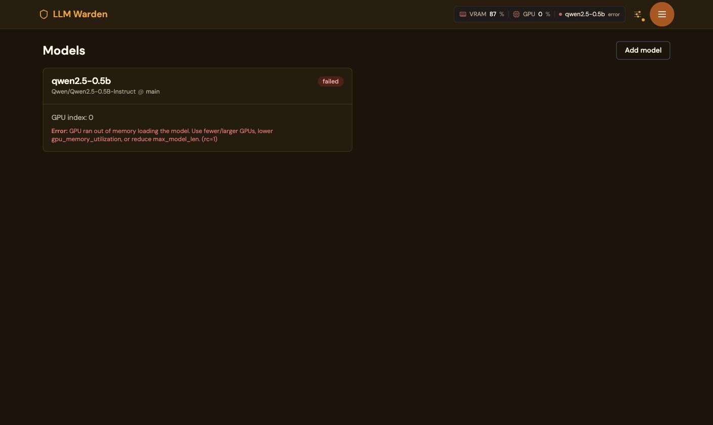
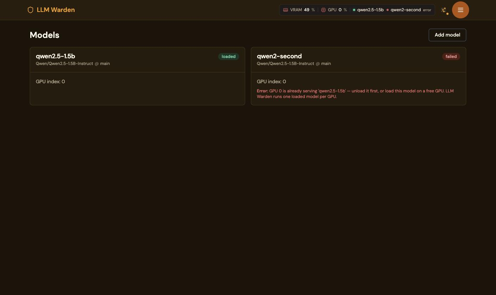
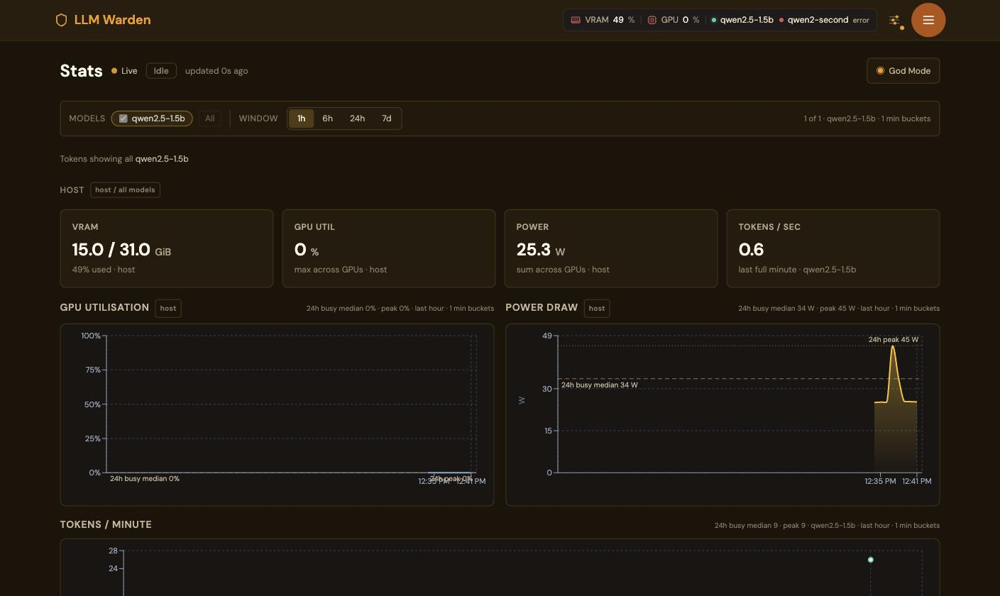

# Installing LLM Warden

This is a step-by-step manual for getting LLM Warden onto your own hardware. It
is written from two recorded installs on a real machine, not from what the
software is supposed to do. Every command below was run; every block of output
is what the terminal actually printed. Where something went wrong, the error is
here in full, at the step where it happens, with what it means and what to do.

There are two routes, and you should pick one before you start:

| | [Path A: run the published images](#path-a-run-the-published-images) | [Path B: build everything from source](#path-b-build-everything-from-source) |
|---|---|---|
| What you download | ~9.3 GB of image layers | a ~9 GB CUDA base image, then source from GitHub, PyPI and npm |
| What you compile | nothing | llama.cpp against CUDA, `@podwarden/chat-ui`, the Next.js UI |
| Time to a running stack | the image pull, then seconds | ~19 minutes on 32 threads; 1–3 hours on 4–8 cores — or ~5 minutes if you narrow the CUDA architectures to your own card ([B2](#b2-build-and-how-long-it-really-takes)) |
| Disk | ~40 GB | ~40 GB, plus a BuildKit cache that reached 39 GB here |
| Choose it if | you want to run the software | you want the binaries to be ones you built, or you need to change the CUDA architectures, the llama.cpp pin, or the chat-ui pin |

Path B is not harder to *drive* — it is four commands — but it is longer, it
prints alarming output that is not a problem (see [B3](#b3-seven-red-error-lines-in-a-successful-build)),
and the build time is dominated by a CUDA compile that scales with your core
count. If you have no reason to build, take Path A.

Both paths converge at [First run](#first-run-setting-up-without-a-browser).

Path A has three variants that end in the same place: unattended
([A5](#a5-unattended)), without a clone ([A6](#a6-without-a-clone)), and with
no route to the internet ([A7](#a7-offline--air-gapped-install)).

---

## About the transcripts in this document

Two installs were recorded on the same machine:

- **Path A** against release `v2026.09.06.4`, installed from the published images.
- **Path B** against release `v2026.09.06.5`, built from a fresh public clone
  with no npm token and no registry login.

The host, both times:

```
AMD Ryzen 9 5950X, 16 cores / 32 threads, 62.7 GiB RAM
Ubuntu 22.04.5 LTS, kernel 5.15.0-170-generic
Docker Compose 5.5.0, NVIDIA driver 610.43.02 / CUDA 13.3
GPU 0  NVIDIA RTX A4000   16376 MiB  (Ampere, compute 8.6)
GPU 1  Quadro RTX 5000    15360 MiB  (Turing, compute 7.5)
```

Two heterogeneous cards, deliberately — a machine that grew rather than one that
was specified. Your numbers will differ, and where a figure depends on the host
this document says so instead of quoting it as a constant.

The only edits made to the transcripts are that the installing user's home
directory is written as `/home/you`, and host addresses are written as
`YOUR-HOST`. Nothing else has been reworded, tidied or shortened without a `…`.

---

## Before you start

### What the host needs

- **Linux x86_64** with Docker Engine and the Docker Compose v2 plugin, 2.24 or
  newer. Check with `docker compose version`. A v5.x plugin is fine — this host
  ran `Compose 5.5.0` and the installer accepted it without comment. The
  generated override uses Compose's `!override` tag.
- **One or more NVIDIA GPUs** with the driver installed, such that `nvidia-smi`
  lists them.
- **The NVIDIA Container Toolkit, registered with Docker.** A working
  `nvidia-smi` is not sufficient and this is the single most likely thing to
  stop you at step A2. See [A2](#a2-preflight-first).
- **40 GB free on the Docker data root** — the filesystem under
  `docker info --format '{{.DockerRootDir}}'`, usually `/var/lib/docker`, which
  is often not the one under `/`.
- **`curl` and `jq`**, if you intend to drive the first run or the model API from
  the shell rather than the browser. `jq` is not part of a normal Ubuntu server
  install and was missing on this host; every scripted example below pipes to
  it. Install it first (`apt install jq`) or substitute `python3 -m json.tool`,
  which is what the trial did.

A GPU is needed to *run* the api image. It is not needed to build it.

### What it will cost you in disk

Measured on the host, for one release:

| Image | On disk | On the wire |
|---|---|---|
| `vllm-warden` (api) | 28.9 GB | 9.22 GB |
| `vllm-warden-ui` | 313 MB | 75.5 MB |
| `caddy:2-alpine` | 88.7 MB | 24.3 MB |

The 28.9 GB is not a mistake and not a redundant copy you can avoid: the image
unpacks to about 19.7 GB, and a current Docker Engine's containerd image store
keeps the compressed layers alongside it. **Every release you keep costs another
~29 GB.** Two releases coexisted on this host during the trial and together held
~58 GB.

Models come on top of that and are not small. The HuggingFace cache — the
`vw-hfcache` volume — grows with every model you pull and has no bound.

The installer measures free space there, warns under 40 GB, and refuses a
first pull under 20 GB, where the image cannot even be unpacked (`--check`
reports the number without installing).

### `VW_COOKIE_SECRET` is mandatory and has no fallback

`install.sh` writes this one for you, so on Path A and Path B you will not
meet it. Anyone starting the stack any other way will, on the first boot.

<!-- The `shared:` marker pairs in this file fence generated regions. Their text
     is shared with the PodWarden Hub catalogue listing for this app, and
     `scripts/sync-shared-docs.py` rewrites them -- a hand edit inside a pair is
     reverted on the next sync and fails CI in the meantime. Everything outside
     those markers is hand-written: edit it freely. -->

<!-- shared:cookie-secret -->
`VW_COOKIE_SECRET` is the session-cookie signing key. It must be set and at
least 32 characters; there is no default and no generated-on-first-boot
fallback. A container started without it does not come up degraded — it raises
`RuntimeError: VW_COOKIE_SECRET must be set and >=32 chars` during startup and
exits.

`install.sh` generates one into `.env` on a first run. Anywhere else — raw
`docker compose`, an orchestrator, a CI job — supply it yourself:

```bash
openssl rand -hex 24
```

Keep it stable across restarts. Changing it invalidates every existing session
cookie, so everyone is signed out. `VW_JWT_SECRET`, by contrast, is optional: left
blank it is minted once and persisted under the data directory, and it only needs
setting explicitly to share or rotate one across hosts.
<!-- /shared:cookie-secret -->

---

# Path A: run the published images

## A1. Clone the repository

```
$ git clone https://github.com/Podwarden/vllm-warden.git
$ cd vllm-warden && git rev-parse HEAD
00ff68dd5815677c101c507075cf88a1de86a55d
```

Everything needed to run the stack is in this tree: `docker-compose.yml` is the
stack, `.env.example` is the configuration contract, `install.sh` turns them
into a running install, and the `Makefile` runs it day to day.

## A2. Preflight first

`./install.sh --check` runs the host checks and writes nothing. Run it before
anything else. On this host it failed, and the failure is worth reading in full
because it is the one most people will hit:

```
$ ./install.sh --check

LLM Warden installer

[vllm-warden] Checking this host...
[vllm-warden] Docker OK, Compose 5.5.0.
[vllm-warden] Disk OK: 632 GB free on /var/lib/docker (Docker data root).
[vllm-warden] Detected 2 NVIDIA GPU(s):
    [0] NVIDIA RTX A4000 (16376 MiB)
    [1] Quadro RTX 5000 (15360 MiB)
[vllm-warden] No terminal to ask on: passing through all 2 GPUs (restrict with --gpus).
[vllm-warden] Passing through all 2 GPU(s).
[vllm-warden] NVIDIA GPUs are present, but Docker cannot pass them to containers:
[vllm-warden]   the NVIDIA Container Toolkit is installed but not registered with Docker.
[vllm-warden]   Starting the stack as-is fails with:
[vllm-warden]     could not select device driver "nvidia" with capabilities: [[gpu]]
[vllm-warden] Skipping. Install it yourself and re-run ./install.sh (or: make preflight):
[vllm-warden]   https://docs.nvidia.com/datacenter/cloud-native/container-toolkit/latest/install-guide.html
[vllm-warden]   Unattended: GPU_TOOLKIT_INSTALL=yes ./install.sh ...
[vllm-warden] Preflight failed: Docker cannot use the GPUs (see above).
EXIT: 1
```

### What that means

The NVIDIA driver was fine. `nvidia-smi` worked. The container toolkit was even
installed (`nvidia-container-toolkit 1.20.0-1`, `nvidia-ctk` on `PATH`). What was
missing was the registration step: Docker had no `nvidia` runtime and no
`/etc/docker/daemon.json`, because on that host the GPUs were being consumed by
containerd directly and Docker had never needed them.

If you skip the preflight and start the stack anyway, the failure you get is
`could not select device driver "nvidia" with capabilities: [[gpu]]` at container
start, which is a good deal less informative.

### Fixing it

Either install and register the toolkit yourself from NVIDIA's guide and re-run
`./install.sh --check`, or let the installer do it with
`GPU_TOOLKIT_INSTALL=yes`.

> **`GPU_TOOLKIT_INSTALL=yes` restarts the Docker daemon.** Registering the
> runtime writes `/etc/docker/daemon.json` and then restarts `dockerd`, which
> restarts **every container on the host**, not only this stack's. On the trial
> host this bounced three unrelated containers; all had a restart policy and
> came back. Anything running without one does not. If the host does other work,
> install the toolkit yourself at a time of your choosing.

Exit status from the installer: `0` installed and startable, `1` a preflight or
argument problem, `2` files written but the stack cannot start yet.

## A3. Install

```
$ GPU_TOOLKIT_INSTALL=yes ./install.sh --gpus all --yes --start
```

```
### START

LLM Warden installer

[vllm-warden] Checking this host...
[vllm-warden] Docker OK, Compose 5.5.0.
[vllm-warden] Disk OK: 632 GB free on /var/lib/docker (Docker data root).
[vllm-warden] Detected 2 NVIDIA GPU(s):
    [0] NVIDIA RTX A4000 (16376 MiB)
    [1] Quadro RTX 5000 (15360 MiB)
[vllm-warden] Passing through all 2 GPU(s).
…
level=info msg="Wrote updated config to /etc/docker/daemon.json"
level=info msg="It is recommended that docker daemon be restarted."
[vllm-warden] Restarting Docker so it picks up the nvidia runtime...
[vllm-warden] NVIDIA Container Toolkit is ready; Docker can now use the GPUs.
[vllm-warden] Created .env from .env.example.
[vllm-warden] Generated 1 secret(s) in .env.
[vllm-warden] Pinned VERSION=v2026.09.06.4, the release this source tree documents (override with --version).
[vllm-warden] Wrote docker-compose.override.yml (release v2026.09.06.4, GPUs: 2 (indices 0,1), port 8080).
[vllm-warden] Compose configuration validates.
[vllm-warden] Pulling release images (v2026.09.06.4)...
…
[vllm-warden] Starting...
…
 Container vllm-warden-api-1     Started
 Container vllm-warden-ui-1      Started
 Container vllm-warden-caddy-1   Started

LLM Warden is installed in /home/you/vllm-warden

  UI:      http://localhost:8080/ui/    (first run opens the setup wizard)
  API:     http://localhost:8080/v1/chat/completions
  Logs:    cd /home/you/vllm-warden && make logs
  Config:  /home/you/vllm-warden/.env   (release: v2026.09.06.4, port: 8080, GPUs: 2 (indices 0,1))
  Help:    make help

### EXIT=0
```

### How long this takes

**The trial cannot tell you honestly.** Wall clock on that run was 5 seconds,
because Docker already held a previous release and the pull moved about 26 MB of
changed layers. A first-time host on a clean Docker downloads ~9.3 GB and unpacks
~29 GB, and how long that takes is entirely your link. Budget minutes, not
seconds, and watch `docker compose pull` rather than a stopwatch.

### What it wrote

Three files, with clearly separated ownership:

| File | Written by | What it holds |
|---|---|---|
| `docker-compose.yml` | git | the stack: services, wiring, volumes. Never edited by the installer |
| `.env` | `install.sh`, once | secrets, `VERSION`, `WARDEN_PORT`, `VW_*` knobs |
| `docker-compose.override.yml` | `install.sh`, every run | the release images, the GPU selection, health checks, the front-door port |

`.env`, with the secret redacted, was:

```
VERSION=v2026.09.06.4
WARDEN_PORT=8080
COMPOSE_PROJECT_NAME=vllm-warden
VW_COOKIE_SECRET=<generated>
VW_JWT_SECRET=
VW_FRONTEND_ORIGIN=
VW_TRUST_PROXY_ORIGIN=0
VW_CONTAINER_GPU_COUNT=2
VW_GODMODE_ENABLED=false
```

Re-running the installer is safe: `.env` is kept, only blank secrets are filled
in, and the override is regenerated.

## A4. Check the front door

```
$ make smoke
GET /               -> 200
GET /_landing       -> 200
GET /ui/            -> 200
GET /api/csrf       -> 200
GET /healthz        -> 200
smoke OK
```

and

```
$ make status
NAME                  IMAGE                                    SERVICE   STATUS
vllm-warden-api-1     …/vllm-warden:v2026.09.06.4              api       Up 10 minutes (healthy)
vllm-warden-caddy-1   caddy:2-alpine                           caddy     Up 10 minutes
vllm-warden-ui-1      …/vllm-warden-ui:v2026.09.06.4           ui        Up 10 minutes
```

### If `make smoke` fails immediately after starting the stack

It is almost certainly a race, not a broken install. See
[B4](#b4-bring-the-stack-up-and-the-make-restart--make-smoke-race), which
documents it in full; the short version is that `docker compose up -d` returns
when containers are *started*, not when they are serving, and the failure looks
like this:

```
make: *** [Makefile:147: smoke] Error 56
```

Wait fifteen seconds and run `make smoke` again.

## A5. Unattended

The interactive run asks three things — which GPUs, whether to install the
toolkit, whether to start — and each has a flag, so a script never prompts:

```bash
./install.sh --gpus all --yes --start                                   # all GPUs, start now
./install.sh --gpus 0,1 --origin https://llm.example.com --port 8080 --yes
GPU_TOOLKIT_INSTALL=yes ./install.sh --gpus all --yes                   # also install the toolkit
./install.sh --gpus none --yes                                          # CPU-only control plane (evaluation, CI)
./install.sh --check                                                    # preflight only, writes nothing
```

| Flag | Meaning |
|---|---|
| `--dir PATH` | install directory (default: the checkout; `/opt/vllm-warden` or `~/vllm-warden` when downloaded) |
| `--version TAG` | release to run, e.g. `v2026.09.06.2` or `latest` (default: the newest release in `changelog.md`) |
| `--gpus all\|none\|0,1` | GPUs passed to the engine, by `nvidia-smi` index |
| `--origin URL[,URL]` | `VW_FRONTEND_ORIGIN`: the public URL(s) of the UI, enforced by the CSRF check once set |
| `--port N` | `WARDEN_PORT`: host port of the single published front door (8080) |
| `--no-generate-secrets` | leave `VW_COOKIE_SECRET` blank for you to fill in |
| `--no-pull` | do not pull images (air-gapped: `make load-images` first) |
| `--start` / `--no-start` | start when done / never (default: ask on a terminal) |
| `-y`, `--yes` | never prompt |
| `--check` | run the host preflight and stop |
| `GPU_TOOLKIT_INSTALL=yes\|no` | install the NVIDIA Container Toolkit without asking / never. **`yes` restarts the Docker daemon** — see [A2](#a2-preflight-first) |

Exit statuses are as in [A2](#a2-preflight-first), and so is the warning
about `GPU_TOOLKIT_INSTALL=yes` restarting every container on the host.

## A6. Without a clone

```bash
curl -fsSL https://raw.githubusercontent.com/Podwarden/vllm-warden/main/install.sh | sh -s -- --dir /opt/vllm-warden
```

Downloads the source tree into `--dir`, then proceeds exactly as above. Prompts
still work when piped (the script reads them from the terminal, not stdin); add
`--yes` for automation.

## A7. Offline / air-gapped install

Nothing in the stack needs the internet at run time except model pulls from
HuggingFace, and those can be pre-seeded. The transport is three image tarballs
plus, optionally, a tarball of the model cache; the `make` targets address the
same image names and volume the stack uses, so nothing is typed twice.

On a machine **with** internet access:

```bash
VERSION=v2026.09.06.2                                   # pick a release from changelog.md
git clone https://github.com/Podwarden/vllm-warden.git && cd vllm-warden

# 1. Stage an install (no GPU needed here) and save its images:
#    vllm-warden, vllm-warden-ui and caddy:2-alpine, all at $VERSION.
./install.sh --dir /tmp/vw-stage --version "$VERSION" --gpus none --yes
make -C /tmp/vw-stage save-images IMAGES_FILE=/tmp/llm-warden-$VERSION.tar

# 2. (Optional) pre-seed the model cache. The api pulls with
#    snapshot_download(cache_dir=<volume root>), so download with the same
#    layout: models--org--name directories at the top of the tarball.
pip install -U huggingface_hub
huggingface-cli download --cache-dir /tmp/hf-seed Qwen/Qwen2.5-7B-Instruct
tar -C /tmp/hf-seed -cf /tmp/hf-cache.tar .
```

Copy the source tree (this checkout or the GitHub tarball),
`llm-warden-$VERSION.tar` and `hf-cache.tar` to the isolated host. There:

```bash
# Docker, Compose 2.24+, the NVIDIA driver and the NVIDIA Container Toolkit
# come from your own OS mirrors -- the installer cannot download them here.
cd vllm-warden
make load-images IMAGES_FILE=/path/llm-warden-$VERSION.tar
./install.sh --version "$VERSION" --no-pull --gpus all --yes
make import-hf-cache CACHE_FILE=/path/hf-cache.tar        # optional
echo 'HF_HUB_OFFLINE=1' >> .env                           # never contact huggingface.co
make start
make smoke
```

Then add the model in the UI by its HuggingFace name
(`Qwen/Qwen2.5-7B-Instruct`); with `HF_HUB_OFFLINE=1` the pull resolves from the
seeded cache. `make export-hf-cache` does the reverse on a running install, so a
cache warmed on one host can seed the next.

`make smoke` is the right check after this route too: it asserts that the
front door is really serving, whichever way the images arrived.

---

# First run: setting up without a browser

Both paths arrive here. If you would rather click, open
`http://YOUR-HOST:8080/ui/` and the first-run wizard covers the same ground —
skip to [Adding a model](#adding-a-model). What follows is the scripted
equivalent, which was run verbatim on the trial host and produced exactly these
answers. [API.md](API.md#first-run-without-a-browser) is the same sequence in
compact form, followed by the model-lifecycle calls.

Setup is a strict state machine. Posting out of order returns
`400 not at <x> step (current: <y>)`. `/api/setup/*` is exempt from the CSRF
check, so no token is needed for these six calls — that changes at
[Minting a key](#minting-an-api-key).

```bash
W=http://127.0.0.1:8080
```

**1. Where are we?**

```
$ curl -s $W/api/setup/state
{"step":"welcome","done":false}
```

**2. Acknowledge the welcome step.**

```
$ curl -s -X POST $W/api/setup/welcome
{"step":"gpus"}
```

**3. List the GPUs the container can see.**

```
$ curl -s $W/api/setup/gpus
[{"index":0,"name":"NVIDIA RTX A4000","memory_total_mib":16376,"memory_used_mib":1,"utilization_pct":0},
 {"index":1,"name":"Quadro RTX 5000","memory_total_mib":15360,"memory_used_mib":1,"utilization_pct":0}]
```

**4. Choose which of those indices the engine may use.**

```
$ curl -s -X POST $W/api/setup/gpus -H 'Content-Type: application/json' \
    -d '{"allowed_gpu_indices":[0,1]}'
{"step":"hf_token"}
```

**5. HuggingFace token.** JSON `null` is valid and is the right answer unless you
need gated models — Llama, Mistral, gpt-oss.

```
$ curl -s -X POST $W/api/setup/hf_token -H 'Content-Type: application/json' \
    -d '{"hf_token":null}'
{"step":"admin","whoami":null}
```

**6. Create the admin account.**

```
$ curl -s -X POST $W/api/setup/admin -H 'Content-Type: application/json' \
    -d '{"username":"admin","password":"…"}'
{"step":"done"}
```

Password rules are enforced and are not obvious: **at least 6 characters and at
most 72 bytes.** The upper bound is bcrypt's, and it is rejected outright rather
than silently truncated — worth knowing before you generate a long passphrase.

**Confirm.**

```
$ curl -s $W/api/setup/state
{"step":"done","done":true}
```

`GET /api/setup/gpus` returns `404` from this point on. That is deliberate — it
stops the endpoint leaking hardware detail after setup — and is not a sign that
anything broke.

---

# Minting an API key

Everything past `/api/setup` enforces CSRF, and the bootstrap is a two-part dance
that is easy to get subtly wrong. Both mistakes produce the *same* opaque error.

```bash
CSRF=$(curl -s -c jar $W/api/csrf | jq -r .csrf)

JWT=$(curl -s -b jar -c jar -X POST $W/api/auth/login \
        -H 'Content-Type: application/json' \
        -d '{"username":"admin","password":"…"}' | jq -r .access_token)

curl -s -b jar -X POST $W/api/tokens \
     -H 'Content-Type: application/json' \
     -H "Authorization: Bearer $JWT" -H "X-CSRF-Token: $CSRF" \
     -d '{"name":"my-first-key"}'
```

```json
{"id":"e17c6f99faf36fc034fb300616cb7b78","name":"my-first-key",
 "plaintext":"vw_s7zngjc5t3hgx745l4e5c2yy54s3rarcb4rky2oqm4acou3q5ersswsa",
 "prefix":"vw_s7zng","preview":"vw_s7zng","expires_at":"2027-09-06 19:35:19",
 "rate_limit_tps":null,"priority":5}
```

`plaintext` is shown once. Save it now.

### Failure: `403 {"detail":"csrf token invalid"}`

This exact response has two distinct causes and the message distinguishes
neither. Both were hit during the trial.

**Cause 1 — you read the wrong JSON field.** `GET /api/csrf` returns the key
`csrf`, not `csrf_token`. Reading `.csrf_token` yields an empty string, sends an
empty header, and gets:

```
$ curl … -H "X-CSRF-Token: " -d '{"name":"wrong-field"}'
{"detail":"csrf token invalid"}
```

**Cause 2 — you dropped the cookie jar.** The CSRF token is bound to the
`vw_csrf_id` cookie that `GET /api/csrf` set. The header alone is not enough.
Omitting `-b jar` gives you the identical error:

```
--- without -b jar:
  HTTP 403  {"detail":"csrf token invalid"}
--- same call with -b jar added:
{"id":"9e97b57c2fb3455c","served_model_name":"qwen2.5-1.5b","status":"registered"}
```

This is worth dwelling on because the error text points at the CSRF token, which
the reader has just copied correctly. It is the *cookie* that is missing. If you
are collecting shared headers into a variable, put `-b jar` inside it:

```bash
AUTH=(-b jar -H "Authorization: Bearer $JWT" -H "X-CSRF-Token: $CSRF"
      -H 'Content-Type: application/json')
```

The `/v1/*` OpenAI-compatible endpoints are exempt from CSRF and take only the
`vw_` key as a bearer token. `/api/*` needs all three: cookie, JWT, CSRF header.

The JWT itself is short-lived — its claims show `exp - iat = 900`, fifteen
minutes. Long-running scripts should re-login rather than cache it.

---

# Adding a model

Register, pull and load are three separate asynchronous steps. `POST` returns
`202` with a status you then poll from a different endpoint.

**1. Register.** `gpu_indices` is required and must be a subset of what you
allowed during setup.

```
$ curl -s "${AUTH[@]}" -X POST $W/api/models -d '{
    "served_model_name":"qwen2.5-1.5b",
    "hf_repo":"Qwen/Qwen2.5-1.5B-Instruct",
    "gpu_indices":[0],
    "max_model_len":8192}'
{"id":"9895a1829559533c","served_model_name":"qwen2.5-1.5b","status":"registered"}
```

**2. Pull the weights.**

```
$ curl -s "${AUTH[@]}" -X POST $W/api/models/9895a1829559533c/pull
{"status":"pulling","force":false}
```

Progress is a **server-sent event stream** — `data: {…}` lines, roughly one a
second — not a JSON document. Read it line by line; piping it to `jq` will not
work.

```
$ curl -sN $W/api/models/9895a1829559533c/pull/progress -H "Authorization: Bearer $JWT"
data: {"status": "pulling", "bytes": 0,          "total": null,       "last_error": null}
data: {"status": "pulling", "bytes": 11506303,   "total": 3098973447, "last_error": null}
  …
data: {"status": "pulled",  "bytes": 3098973447, "total": 3098973447, "last_error": null}
```

Timing, measured on a genuinely cold cache: 3,098,973,447 bytes — 2.89 GiB — in
**27 seconds**, about 115 MB/s. That is a fast link. Scale it by your own: a 7B
AWQ checkpoint at ~5 GB would be about 45 seconds here and several minutes on a
20 Mbit line.

**3. Load it onto the GPU.**

```
$ curl -s "${AUTH[@]}" -X POST $W/api/models/9895a1829559533c/load
{"status":"loading","port":10000}
```

**4. Watch it become `loaded`.**

```
[17:22:30] loading
…
[17:23:18] loaded | None
```

49 seconds in one run, ~70 seconds in the other. That is cold start — weights to
the card, CUDA graph capture, warmup probe — and it is normal.

```
$ nvidia-smi --query-gpu=index,memory.used,memory.total --format=csv,noheader
0, 15409 MiB, 16376 MiB
1, 1 MiB, 15360 MiB
```

### A 1.5B model is holding 94% of a 16 GiB card. That is correct.

Weights for this model are about 3 GB. The card shows 15409 MiB used because
`gpu_memory_utilization` defaults to **0.9 and is a fraction of the whole card,
not of the model**. vLLM takes that fraction and fills what the weights do not
use with KV cache. The engine log says so exactly:

```
[gpu_worker.py:560]     Available KV cache memory: 10.55 GiB
[kv_cache_utils.py:2177] GPU KV cache size: 395,264 tokens
[core.py:340] init engine (profile, create kv cache, warmup model) took 20.32 s (compilation: 10.33 s)
```

10.55 GiB of KV cache reserved for a model with ~3 GB of weights. **Sizing a card
by weights alone will mislead you.** The reservation, not the weights, is what
fills it.

### Failure: the load says `failed` with an out-of-memory error



```
[17:05:30] failed | GPU ran out of memory loading the model. Use fewer/larger
                    GPUs, lower gpu_memory_utilization, or reduce max_model_len. (rc=1)
```

That message is accurate and actionable, and the three levers it names are the
right ones. What it will not tell you is whether something *else* is holding the
card. On the trial host a previous, unrelated deployment held 14 GiB of GPU 0, and
the underlying engine error was:

```
ValueError: Free memory on device cuda:0 (1.65/15.6 GiB) on startup is less than
desired GPU memory utilization (0.13, 2.03 GiB). Decrease GPU memory utilization
or reduce GPU memory used by other processes.
```

Worse, on the first attempt the surfaced message was only:

```
[17:03:19] failed | vllm subprocess exited unexpectedly (rc=1)
```

If you get that bare `rc=1`, check the card before you touch any tuning knob:

```
$ nvidia-smi --query-compute-apps=pid,process_name,used_memory --format=csv
pid, process_name, used_gpu_memory [MiB]
4119602, llama-server, 14112 MiB
4119055, llama-server, 13626 MiB
```

Once the card was genuinely free, the same model loaded first try at the
*default* `gpu_memory_utilization` of 0.9 — no `--enforce-eager`, no lowered
fraction, no `max_model_len` tuning.

### Failure: `GPU 0 is already serving '…'` — this is not a VRAM problem



Register a second model on a GPU that already has one loaded and you get:

```
GPU 0 is already serving 'qwen2.5-1.5b' — unload it first, or load this model on a free
GPU. LLM Warden runs one loaded model per GPU.
```

**Read that literally.** It is an exclusive ownership claim, enforced in
`app/runtime/gpu_ownership.py` before anything reaches the engine. It is not a
capacity check and there is no amount of VRAM that satisfies it:

- Lowering `gpu_memory_utilization` **will not help.**
- Lowering `max_model_len` **will not help.**
- A card with 15 GiB free and two 1 GB models still refuses the second.

The remedies are the two the message names: unload the occupant, or pick a free
GPU index. That is what the trial did, and both models then loaded — one per
card:


Two related things to know:

**The `POST` still returns success.** `POST /api/models/{id}/load` answers
`202 {"status":"loading","port":10001}` — with a port already allocated — and the
refusal appears seconds later as `status: failed` with the message in
`last_error`. If you are scripting against this, a `202` does not mean it worked;
poll the status.

**The Settings GPU checklist disagrees with the loader.** The UI warns that a
second model on a busy card will "share the card's VRAM" and that "deliberate
co-location is fine". It is not fine and it is not a sharing question — the
loader refuses unconditionally. This misdiagnosis happened twice during the
trial. Believe the loader.

### A traceback on every first load that is not a fault

The first time a model loads, the log prints:

```
could not rotate /data/logs/9895a1829559533c.log
Traceback (most recent call last):
  File "/app/app/runtime/engine/local_subprocess.py", line 66, in _rotate
    if log_path.stat().st_size < self._log_max_bytes:
FileNotFoundError: [Errno 2] No such file or directory: '/data/logs/9895a1829559533c.log'
```

Log rotation runs before the log file it would rotate exists. The file is created
immediately afterwards and the engine log is captured correctly. Nothing is lost.
It simply reads like a fault.

---

# Making a request

```
$ curl -s $W/v1/models -H "Authorization: Bearer vw_s7zng…"
{"object":"list","data":[{"id":"qwen2.5-1.5b","object":"model","owned_by":"vllm-warden","max_model_len":8192}]}

$ curl -s -o /dev/null -w "no bearer -> HTTP %{http_code}\n" $W/v1/models
no bearer -> HTTP 401
```

```
$ curl -s $W/v1/chat/completions -H "Authorization: Bearer vw_s7zng…" \
    -H 'Content-Type: application/json' \
    -d '{"model":"qwen2.5-1.5b",
         "messages":[{"role":"user","content":"In one sentence, what is a GPU?"}],
         "max_tokens":80,"temperature":0}'
```

```json
{"id":"chatcmpl-89c0938e5727c8c9","object":"chat.completion","created":1788723484,
 "model":"qwen2.5-1.5b",
 "choices":[{"index":0,"message":{"role":"assistant",
   "content":"A GPU (Graphics Processing Unit) is a specialized processor designed to accelerate the performance of graphics and computational tasks in computer systems.",
   "refusal":null,…},"logprobs":null,"finish_reason":"stop",…}],
 "system_fingerprint":"vllm-0.26.0-aee93ac4",
 "usage":{"prompt_tokens":38,"total_tokens":64,"completion_tokens":26,…}}
```

That is the whole point of the exercise: an OpenAI-shaped response from a model
on your own card. Point any OpenAI client at `$W/v1` with the `vw_` key.

If you get `{"detail":"model 'x' is not loaded"}`, the model is registered and
possibly pulled, but not loaded. Check `GET /api/models`.

---

# Path B: build everything from source

Path B produces the same two images from source, with no token, no account and no
private registry in the build. Every input is public: Docker Hub, PyPI,
`registry.npmjs.org`, and pinned commits on GitHub.

The whole sequence is four commands:

```bash
git clone https://github.com/Podwarden/vllm-warden.git
cd vllm-warden

# .env + docker-compose.override.yml, without touching any registry:
# --no-pull and --no-start mean nothing is downloaded and nothing is started.
./install.sh --gpus all --no-pull --no-start -y

docker compose build
make restart
make smoke
```

The rest of this section is what each of those actually prints.

## B1. Prepare the files without downloading anything

```
$ ./install.sh --gpus all --no-pull --no-start -y

LLM Warden installer

[vllm-warden] Checking this host...
[vllm-warden] Docker OK, Compose 5.5.0.
[vllm-warden] Disk OK: 672 GB free on /var/lib/docker (Docker data root).
[vllm-warden] Detected 2 NVIDIA GPU(s):
    [0] NVIDIA RTX A4000 (16376 MiB)
    [1] Quadro RTX 5000 (15360 MiB)
[vllm-warden] Passing through all 2 GPU(s).
[vllm-warden] NVIDIA Container Toolkit OK: Docker exposes the nvidia runtime.
[vllm-warden] Created .env from .env.example.
[vllm-warden] Generated 1 secret(s) in .env.
[vllm-warden] Pinned VERSION=v2026.09.06.5, the release this source tree documents (override with --version).
[vllm-warden] Wrote docker-compose.override.yml (release v2026.09.06.5, GPUs: 2 (indices 0,1), port 8080).
[vllm-warden] Compose configuration validates.
[vllm-warden] --no-pull: not pulling images; the stack expects them to be loaded already (make load-images).

LLM Warden is installed in /home/you/vllm-warden
```

Exit 0. Nothing downloaded, nothing started, exactly as documented.

## B2. Build, and how long it really takes

```
$ docker compose build --no-cache
start  07:23:16 PM UTC
end    07:28:25 PM UTC
EXIT=0
```

**5 minutes 09 seconds, exit 0, both images built** — on 32 threads, against
the tree as it stood on 2026-09-06, when the llama.cpp compile still targeted
two CUDA architectures. **That default has since widened to all thirteen and
this number no longer applies — see [the table below](#the-cuda-architecture-list-is-now-the-build-argument-that-decides-this).**
Where it went at the time:

```
   240.7s  [api llamacpp-build] cmake … -DCMAKE_CUDA_ARCHITECTURES="75-real;86-real" … --target llama-server
    55.7s  [ui  build]          npm run build
    43.4s  [api llamacpp-build] git clone https://github.com/ggml-org/llama.cpp && git checkout b10731
    17.7s  [ui  chatui]         npm ci    (chat-ui's own lockfile)
    16.8s  [ui  deps]           npm ci    (frontend lockfile)
    13.1s  [api llamacpp-build] apt-get install cmake git libssl-dev ca-certificates
    12.6s  [api]                python3 - <<'PY'  (gguf-plugin patch)
    10.5s  [api]                exporting to image
     6.7s  [ui  chatui]         npm run build      (tsup compile of chat-ui)
     5.4s  [api]                pip install nvidia-nccl-cu13==2.30.4
     2.2s  [api]                pip install -r requirements.txt
     1.8s  [ui  chatui]         git clone chat-ui + checkout --detach
     1.0s  [ui  chatui]         npm pack
```

**The llama.cpp CUDA compile plus its clone is 284 s of the 309 — 92% of the
build.** It ran `-j32`. That share is the durable finding; the absolute number
is not.

### The CUDA architecture list is now the build argument that decides this

The compile step was re-measured on the same host (Ryzen 9 5950X, 16C/32T,
`-j32`) across three architecture lists. Only `-DCMAKE_CUDA_ARCHITECTURES`
changed; the apt and clone layers were cache hits, so these are the compile and
nothing else:

| `--build-arg LLAMACPP_CUDA_ARCHS=` | compile step | `/opt/llamacpp` | api image |
| --- | --- | --- | --- |
| `86-real` — one card | **158.3 s** | 67.7 MB | — |
| `75-real;86-real` — the old default | **239.6 s** | 85.3 MB | 28.9 GB |
| the current default, 12 `-real` + `90-virtual` | **1068.5 s** | 284.9 MB | 29.3 GB |

The cost is linear: about 77 s of fixed C++/link work plus **81 s per
architecture** at `-j32`. Scale by your own core count — but not past your RAM.
Thirteen device compilations per `.cu` keep every parallel lane busy at once, so
`-j` is capped at one lane per 512 MiB of build memory (a 4 GiB machine builds
7-wide however many cores it has); on a memory-poor host an unbounded `-j` gets
the *builder* OOM-killed rather than merely swapping. Override the calculation
with `--build-arg LLAMACPP_BUILD_JOBS=N`.

So a cold `docker compose build --no-cache` on that same 32-thread host is now
**about 19 minutes** rather than 5, and on 4–8 cores the llama.cpp step alone
is **1–3 hours**. Read that before you start it, not forty minutes in.

**And this is the way out, which is why it is an argument and not a line to
edit:**

```bash
docker compose build --build-arg LLAMACPP_CUDA_ARCHS="86-real" api
```

One architecture is *faster than this repo has ever been* — 158 s against the
old default's 240 s. Find your card's number with
`nvidia-smi --query-gpu=compute_cap --format=csv` and drop the dot: 8.6 → `86`.

### Do not quote 5 minutes as your number

Two things were warm on that host and will not be on yours:

1. **The `vllm/vllm-openai` base image was already local** — 9.22 GB compressed,
   28.8 GB unpacked — as was `node:20-alpine`. A first-time host pays that
   download on top of the build.
2. **`--no-cache` invalidates layers but not BuildKit `type=cache` mounts.** The
   pip and npm caches were warm, which is why `pip install -r requirements.txt`
   took 2.2 s and the two `npm ci` steps 17 s each. On a virgin host, add roughly
   1–3 minutes.

So a genuinely virgin 32-core host should expect **20–22 minutes of build plus
the base-image download** at the current default, and a 4–8 core host should
expect the llama.cpp step alone to run for **1–3 hours**, because that step is
core-count bound and not download-bound. This is the number that varies most
between machines — and the one the `LLAMACPP_CUDA_ARCHS` argument above exists
to cut.

### Which cards the shipped build covers

The floor is **Turing (sm_75)**. The base image is CUDA 13, which dropped
Maxwell, Pascal and Volta — a GTX 1080 Ti, a Titan X or a V100 cannot be
targeted at all, by this build or any rebuild of it. `nvcc --list-gpu-arch`
inside the pinned base answers, verbatim:

```
compute_75 compute_80 compute_86 compute_87 compute_88 compute_89
compute_90 compute_100 compute_110 compute_103 compute_120 compute_121
```

The default `LLAMACPP_CUDA_ARCHS` targets all twelve as `-real` native SASS —
Turing, Ampere, Ada, Hopper and both Blackwell lines — plus one `90-virtual`
PTX entry so a card newer than the release JIT-compiles on first load rather
than finding no backend. You should not need to change it to make your card
work; you may want to change it to make your build shorter. vLLM is unaffected
either way; it comes from upstream's image with upstream's architecture
support.

### The images are tagged with a registry name you cannot pull from

```
$ docker images --format "{{.Repository}}:{{.Tag}}\t{{.Size}}" | grep 2026.09.06.5
registry.podwarden.com/podwarden/apps/vllm-warden:v2026.09.06.5      28.9GB
registry.podwarden.com/podwarden/apps/vllm-warden-ui:v2026.09.06.5   313MB
```

This is intentional — `docker-compose.yml` carries `build:` and the generated
override carries `image:`, so `make restart` runs what you built — but it means
`docker images` afterwards is indistinguishable from a registry pull, and
`make pull` will silently replace your build with the published image. Note which
of the two you are running.

## B3. Seven red `ERROR:` lines in a successful build

A clean, successful build prints seven lines beginning with `ERROR:` in red,
in the middle of a five-minute wait, with nothing to say they are expected. They
are. Verbatim:

```
ERROR: pip's dependency resolver does not currently take into account all the packages that are installed…
torch 2.11.0+cu130 requires nvidia-nccl-cu13==2.28.9; platform_system == "Linux", but you have nvidia-nccl-cu13 2.30.4 which is incompatible.
Successfully installed nvidia-nccl-cu13-2.30.4
nccl runtime lib: /usr/local/lib/python3.12/dist-packages/nvidia/nccl/lib/libnccl.so.2 2.30.4

ERROR: pip's dependency resolver …
vllm 0.26.0 requires fastapi[standard]<0.137.0,>=0.133.0, but you have fastapi 0.115.6 which is incompatible.
vllm 0.26.0 requires starlette>=1.0.1, but you have starlette 0.41.3 which is incompatible.
mcp 1.28.1 requires pyjwt[crypto]>=2.10.1, but you have pyjwt 2.9.0 which is incompatible.
prometheus-fastapi-instrumentator 8.0.2 requires starlette<2.0.0,>=1.0.0, but you have starlette 0.41.3 which is incompatible.
sse-starlette 3.4.6 requires starlette>=0.49.1, but you have starlette 0.41.3 which is incompatible.
model-hosting-container-standards 0.1.16 requires starlette>=0.49.1, but you have starlette 0.41.3 which is incompatible.
```

The nccl line is **deliberate** — the Dockerfile upgrades nccl past torch's pin on
purpose, and immediately asserts that the upgraded wheel is the runtime library,
which is the `nccl runtime lib: … 2.30.4` line directly underneath. The six
starlette/fastapi/pyjwt lines are the application's own pins downgrading what the
vLLM base image shipped. None of them stops the build and none of them is a
problem you need to fix.

The build also prints, harmlessly:

```
rehash: warning: skipping ca-certificates.crt,it does not contain exactly one certificate or CRL
WARNING: Running pip as the 'root' user can result in broken permissions …   (×3)
npm warn deprecated whatwg-encoding@3.1.1: Use @exodus/bytes instead …
npm warn deprecated eslint@9.39.5: This version is no longer supported …
5 vulnerabilities (3 moderate, 1 high, 1 critical)          (chat-ui's own tree)
20 vulnerabilities (3 low, 4 moderate, 12 high, 1 critical) (frontend tree)
INFO … Triton is installed but 0 active driver(s) found (expected 1). Disabling Triton …
WARNING … Failed to import from vllm._C: ModuleNotFoundError("No module named 'vllm._C'")   (×many)
```

The `vllm._C` and Triton warnings are expected: the build host has no GPU visible
to the build, and the steps that print them are plugin patch-verification steps.

## B4. Bring the stack up, and the `make restart && make smoke` race

Run exactly as documented, on a first run, this is what happens:

```
$ make restart && make smoke
docker compose down --remove-orphans
docker compose up -d --no-build --remove-orphans
 …
 Container vllm-warden-api-1     Started
 Container vllm-warden-ui-1      Started
 Container vllm-warden-caddy-1   Started
RESTART_EXIT=0
=== SMOKE ===
	# Expected (final-status, after redirect chain):
	#   /            → 200 (landing page HTML, public)
	#   /_landing    → 200 (same content, direct)
	#   /ui/         → 200 (Next.js root page, possibly /ui/models or /ui/login)
	#   /api/csrf    → 200 (CSRF bootstrap, no auth required)
	#   /healthz     → 200 (uptime probe — Caddy → Next /healthz alias)
make: *** [Makefile:147: smoke] Error 56
```

Two separate things are going on, and it is worth understanding both because the
output tells you neither.

**It is a race.** `docker compose up -d` returns as soon as containers are
*started*, not when they are healthy. The api reached `healthy` at t+11 s and the
Next.js ui takes a similar moment to begin listening. `make smoke` runs about a
second after `make restart` returns, and Caddy's upstream refuses the connection.

**The error message is curl's, not the target's.** `Error 56` is curl's exit code
for a receive failure, leaking through `set -e`. The smoke loop is

```make
code=$$(curl -sL -o /dev/null -w "%{http_code}" "$(SMOKE_URL)$$path"); \
printf "GET %-15s -> %s\n" "$$path" "$$code"; \
```

so when curl itself dies, `set -e` aborts the recipe *before* the `printf`. You
are never told which path failed. The carefully written `FAIL: $path returned
$code` branch below it only ever fires for an HTTP error — never for a connection
error, which is the failure a fresh `make restart` actually produces.

**The fix is to wait.** Re-running the same target unchanged, seconds later,
passes:

```
GET /               -> 200
GET /_landing       -> 200
GET /ui/            -> 200
GET /api/csrf       -> 200
GET /healthz        -> 200
smoke OK
```

So run:

```bash
make restart && sleep 15 && make smoke
```

If it still fails after that, it is a real failure and `make logs S=api` is the
next stop.

## B5. Confirming chat-ui really was compiled from GitHub

The UI image compiles [`@podwarden/chat-ui`](https://github.com/Podwarden/chat-ui)
in its own build stage rather than installing the published tarball. Three things
in the build log show it happened:

**The clone, at the pinned commit:**

```
Cloning into '/src'...
HEAD is now at 83f100f Release v0.1.23
83f100ff28a412d530d170cc8b9bf7c9787656ab
```

which matches `ARG CHATUI_REF` in `frontend/Dockerfile`.

**The compile, and the overlay replacing what `npm ci` installed:**

```
> @podwarden/chat-ui@0.1.23 build
> tsup --config config/tsup.config.ts && cp src/theme/theme.css dist/theme.css && …
CLI tsup v8.5.1
ESM dist/index.js                 139.37 KB
DTS ⚡️ Build success in 4473ms
postbuild: folded chunk-QTG2PFJ5.js into theme/katex.js (katex CSS side effect)
postbuild: 'use client' on 1 file(s): index.js
…
@podwarden/chat-ui 0.1.23 compiled from source and installed
```

**The negative test.** Point `CHATUI_REF` at a different commit and the build
refuses rather than quietly falling back to npm:

```
$ docker build -t vw-ui-negtest \
    --build-arg CHATUI_REF=81b47ac02bf7196a9b2a4176195d827cf1a32a1a frontend/
…
FATAL: the source at CHATUI_REF builds @podwarden/chat-ui@0.1.22,
not the pinned 0.1.23. Fix CHATUI_REF or CHATUI_VERSION.
ERROR: failed to build … did not complete successfully: exit code: 1
```

To build against a fork or an unreleased chat-ui, override the args — no repo
edit needed:

```bash
docker build -t vllm-warden-ui \
  --build-arg CHATUI_REPO=https://github.com/you/chat-ui.git \
  --build-arg CHATUI_REF=<40-char sha> \
  --build-arg CHATUI_VERSION=<version> \
  frontend/
```

`CHATUI_VERSION` must match what `frontend/package.json` depends on, because the
lockfile supplies that release's dependency closure. The pin is a SHA and not a
tag because the public chat-ui mirror carries no tags.

As a side note, the locally compiled tarball is byte-identical to the one on
public npm — `npm pack` printed
`shasum: 6296e1dbfe4b730171ffd54ae9cdb131333db85c` and
`integrity: sha512-AiBzIbTJCMtFw…DqVsyEoruMEJg==`, the same integrity hash
`frontend/package-lock.json` independently pins. Compiling from GitHub reproduces
npm exactly.

## B6. The stack, from images you built

Once `make smoke` passes, the rest is identical to Path A:
[First run](#first-run-setting-up-without-a-browser),
[Minting an API key](#minting-an-api-key),
[Adding a model](#adding-a-model). The trial ran all of it against the
source-built images and got the same answers, including a real completion from a
model on GPU 0.



## B7. If you are installing a release older than v2026.09.06.5

Two things were broken in earlier published releases and are fixed from
`v2026.09.06.5`:

- **The UI image could not be built from a public clone at all.**
  `frontend/Dockerfile` copied `.npmrc` by name — a file the publish
  deliberately strips — so the build died at
  `"/.npmrc": not found`, and dropping an empty one in then died at
  `secret npm: not found`. If you see either error, you are on an older tag.
- **A browser session dropped on every page load over plain HTTP.** The refresh
  cookie was set `Secure`, which a browser will not store on an `http://` origin,
  so every full page load, reload or pasted deep link logged you out and the
  15-minute session could never refresh. Confirmed fixed: a session opened over
  plain HTTP survived a full navigation 17 minutes after login.

---

# Removing it

```
$ make uninstall
This stops LLM Warden and deletes its data volumes (database, HF model cache).
Type yes to continue: yes
docker compose down -v --remove-orphans
[+] down 8/8
 ✔ Container vllm-warden-caddy-1   Removed                                  0.3s
 ✔ Container vllm-warden-ui-1      Removed                                  0.4s
 ✔ Container vllm-warden-api-1     Removed                                  1.1s
 ✔ Volume vllm-warden_caddy-config Removed                                  0.0s
 ✔ Volume vllm-warden_caddy-data   Removed                                  0.0s
 ✔ Volume vllm-warden_vw-data      Removed                                  0.0s
 ✔ Network vllm-warden_default     Removed                                  0.7s
 ✔ Volume vllm-warden_vw-hfcache   Removed                                  0.5s
Volumes removed. Delete this directory to finish: rm -rf /home/you/vllm-warden
```

That part is clean. All four volumes went, the network went, both GPUs were
freed, and nothing was orphaned.

### It needs a terminal

The confirmation is read from `/dev/tty`, not stdin, and there is no
non-interactive escape hatch — no `-y`, no `ASSUME_YES`. Over
`ssh host make uninstall`, or from any script, you get:

```
$ echo yes | make uninstall
This stops LLM Warden and deletes its data volumes (database, HF model cache).
Type yes to continue: /bin/sh: 1: cannot open /dev/tty: No such device or address
aborted
make: *** [make/operator.mk:60: uninstall] Error 1
```

Run it from an interactive shell, or allocate a pty (`ssh -t`).

### It frees far less than you expect

Measured on the trial host, before and after:

```
before:  /dev/nvme0n1p2  915G  246G  623G  29% /
after:   /dev/nvme0n1p2  915G  242G  627G  28% /
```

**4 GB freed.** What survives, and nothing in the output mentions any of it:

| Survives | Size |
|---|---|
| `vllm-warden:v2026.09.06.4` image | 28.9 GB |
| `vllm-warden:v2026.09.04.2` image | 28.9 GB |
| `vllm-warden-ui` images ×2 | 313 MB each |
| `vllm/vllm-openai` base image | 28.8 GB |
| BuildKit cache (if you took Path B) | 31.13 GB |
| the checkout, **including `.env` with your generated secret** | ~500 KB |

That is defensible — images are the expensive thing to re-fetch and `down -v` is
not `docker rmi` — but it is invisible, and the closing line mentions only the
directory. To actually reclaim the space, look at what is there and remove what
you no longer want:

```bash
docker images                 # find the vllm-warden and vllm/vllm-openai entries
docker rmi <image>:<tag>      # remove a release you no longer run
```

And do delete the directory as the closing line says — that is what removes
`.env`, which holds your generated `VW_COOKIE_SECRET`.

---

# Quick reference: symptom to cause

| Symptom | Cause | What to do |
|---|---|---|
| `Preflight failed: Docker cannot use the GPUs` | Container Toolkit not registered with Docker; `nvidia-smi` working is not enough | Install and register it, or `GPU_TOOLKIT_INSTALL=yes` — [A2](#a2-preflight-first) |
| `could not select device driver "nvidia" with capabilities: [[gpu]]` | Same cause, at container start instead of preflight | As above |
| Other containers on the host restarted during install | `GPU_TOOLKIT_INSTALL=yes` restarts `dockerd` | Expected; install the toolkit yourself at a chosen time — [A2](#a2-preflight-first) |
| `make: *** [Makefile:NNN: smoke] Error 56` | Race: `compose up -d` returns before the stack serves. `56` is curl's exit code, not a status from the server | `sleep 15` and re-run — [B4](#b4-bring-the-stack-up-and-the-make-restart--make-smoke-race) |
| `jq: command not found` | `jq` is not installed and is not in the requirements list | `apt install jq`, or substitute `python3 -m json.tool` |
| `403 {"detail":"csrf token invalid"}` | You read `.csrf_token` instead of `.csrf`, **or** you dropped `-b jar` | [Minting an API key](#minting-an-api-key) |
| Piping `/pull/progress` to `jq` produces nothing | It is a server-sent event stream, not JSON | Read it line by line |
| `failed \| vllm subprocess exited unexpectedly (rc=1)` | Usually another process holding the card | `nvidia-smi --query-compute-apps=…` before touching any tuning knob |
| `failed \| GPU ran out of memory loading the model…` | Genuine capacity | Fewer/larger GPUs, lower `gpu_memory_utilization`, lower `max_model_len` |
| `GPU 0 is already serving '…'` | Exclusive ownership claim, one loaded model per GPU | Unload the occupant or use a free index. Tuning VRAM will **not** help — [Adding a model](#adding-a-model) |
| `POST /load` returned `202` but the model says `failed` | Load is asynchronous; refusals surface in `last_error` | Poll the status; a `202` is not a success |
| `FileNotFoundError … could not rotate /data/logs/*.log` | Rotation runs before the log exists, on the first load only | Ignore it |
| A 1.5B model occupies 94% of a 16 GiB card | `gpu_memory_utilization` is a fraction of the *card*, default 0.9 | Expected. Lower it if you need the headroom |
| Seven red `ERROR:` lines during `docker compose build` | Deliberate pin overrides, one asserted immediately afterwards | Ignore them — [B3](#b3-seven-red-error-lines-in-a-successful-build) |
| Stats → System Configuration says "Docker not available" | No docker socket is mounted into the api container, by design | Expected on this deployment; not a broken install |
| `make uninstall` → `cannot open /dev/tty` | The confirmation is read from the terminal, not stdin | Run interactively, or `ssh -t` |
| `make uninstall` freed almost nothing | It removes volumes, not images | `docker rmi` the releases you no longer run — [Removing it](#removing-it) |
| `POST /api/models/fit-preview` rejects `hf_repo` | That endpoint wants `repo_id` and a non-null `filename`, unlike `POST /api/models` | Use it for single-file (GGUF) models, or skip it |
| `/ui/` flashes an empty Models page, then bounces to login | The shell renders before the auth check resolves | Cosmetic; wait for the redirect |
